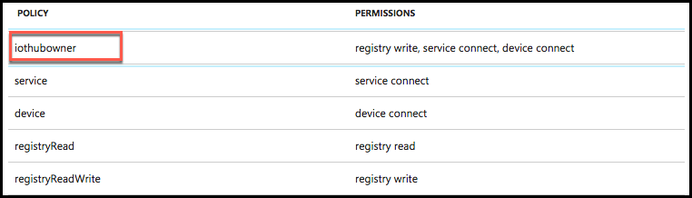

# Before the hands-on lab

Duration: 120 minutes

In the Before the Hands-on Lab exercise, you will set up your environment for use in the rest of the hands-on lab. You should follow all the steps provided in the Before the Hands-on Lab section to prepare your environment before attending the hands-on lab. Failure to do so will significantly impact your ability to complete the lab within the time allowed.

> IMPORTANT: Most Azure resources require unique names. Throughout this lab you will see the word “SUFFIX” as part of resource names. You should replace this with your Microsoft alias, initials, or another value to ensure the resource is uniquely named.

TODO: Replace everything below with an ARM template, and Deploy to Azure button, then move this content to Appendix A.

## Contents

* [Task 1: Provision a resource group](#task-1-provision-a-resource-group)
* [Task 2: Provision an R Server on HDInsight with Spark cluster](#task-2-provision-an-r-server-on-hdinsight-with-spark-cluster)
* [Task 3: Setup a lab virtual machine (VM)](#task-3-setup-a-lab-virtual-machine-vm)
* [Task 4 Install Power BI Desktop on the lab VM](#task-4-install-power-bi-desktop-on-the-lab-vm)
* [Task 5: Prepare an SSH client](#task-5-prepare-an-ssh-client)
* [Task 6: Install R Tools for Visual Studio 2017](#task-6-install-r-tools-for-visual-studio-2017)
* [Task 7: Download and open the vending machines starter project](#task-7-download-and-open-the-vending-machines-starter-project)
* [Task 8: Provision IoT Hub](#task-8-provision-iot-hub)
* [Task 9: Create Microsoft Machine Learning Server on Linux](#task-9-create-microsoft-machine-learning-server-on-linux)
* [Task 10: Create Storage Account](#task-10-create-storage-account)
* [Task 11: Provision Cognitive Services Face API](#task-11-provision-cognitive-services-face-api)
* [Task 12: Provision SQL Database](#task-12-provision-sql-database)

TODO: Type up steps for deploying resources via the ARM template. Basically, they just need to enter a SUFFIX, check the box to accept the terms, and select Create.

## Task 1: Execute ARM template to provision Azure resources

In this task, you will run an Azure Resource Manager (ARM) template to provision many of the Azure resources you will be using throughout this lab.

> Note: If you want to look at the manual steps for creating the resources provisioned by the ARM template, see [Appendix A](./appendix.md).

1. Select the **Deploy to Azure** button below to launch the script in a Custom deployment blade in the Azure portal.

    

2. On the Custom deployment blade, enter the following:

3. Select **Purchase**.

## Task 5: Install R Tools for Visual Studio 2017

1. Run the Visual Studio installer using Start, Run, C:\\Program Files (x86)\\Microsoft Visual Studio\\Installer\\vs\_installer.exe.

    

2. Once the Installer starts, click **Update**. This will take some time to complete and require a reboot.

    

3. Once the update is complete and the VM has restarted, run the installer again. Run the Visual Studio installer using Start, Run, C:\\Program Files (x86)\\Microsoft Visual Studio\\Installer\\vs\_installer.exe.

4. Next select the **Modify** option.

    

5. Select the Data science and analytical applications workload and then click Modify.

    

## Task 6: Download and open the vending machines starter project

Trey Research has provided a starter solution for you. They have asked you to use this as the starting point for creating the Vending Machines solution in Azure.

1. From your LabVM, download the starter project from [here](http://bit.ly/2w6t2qz).

2. Unzip the contents to the folder **C:\\VendingMachines\\.**

3. Open **VendingMachines.sln** with Visual Studio 2017.

4. Sign in to Visual Studio or create an account, if prompted.

5. If the Security Warning for Simulator window appears, **uncheck Ask me for every project in this solution**, and select **OK**.

    

**Note**: If you attempt to build the solution at this point, you will see many build errors. This is intentional. You will correct these in the exercises that follow.

## Task 7: Provision IoT Hub

In these steps, you will provision an instance of IoT Hub.

1. In your browser, navigate to the [Azure portal](https://portal.azure.com).

2. Select **+Create a resource**, then select Internet of Things, and select IoT Hub.

    

3. In the IoT Hub blade, enter the following:

    * Name: Provide a name for your new IoT Hub, such as **vendingmachingshub**

    * Pricing and scale tier: **Select S1 Standard**

    * IoT Hub units: **Set to 1**

    * Device-to-cloud partitions: **Select 4 partitions.**

    * Subscription: Select the same subscription you've been using for previous resources in this lab.

    * Resource group: Select Use existing, and select the **ivmhandsonlab** resource group you created previously.

    * Location: Select the location you used previously.

    * Select **Create**.

        

4. When the IoT Hub deployment is completed, you will receive a notification in the Azure portal. Select **Go** to resource in the notification.

    

5. From the IoT Hub's Overview blade, select **Shared access policies** under Settings on the left-hand menu.

    

6. Select **iothubowner** policy.

    

7. In the **iothubowner** blade, select the Copy button to the right of the Connection string - primary key field. Paste the connection string value into a text editor, such as Notepad, as this will be needed later in this lab.

    

## Task 8: Create Microsoft Machine Learning Server on Linux

In these steps, you will provision and configure a Virtual Machine running Microsoft Machine Learning Server. You will use this machine to host the R Server Operationalization service.

1. In the [Azure Portal](https://portal.azure.com), select **+Create a resource**, enter **Machine Learning Server** into the Search the Marketplace box, select **Microsoft Machine Learning Server 9.3.0 on Ubuntu 16.04** from the results, and select **Create**.

    

2. In the Basics blade, enter:

    * **Name**: Enter LabMLServer

    * **Vm disk type**: Select SSD

    * **User name**: Enter radmin

    * **Authentication type**: Select Password

    * **Password**: Enter and confirm the password, Password.1!!

    * **Subscription**: Select the subscription you are using for this hands-on lab

    * **Resource group**: Choose Use existing, and select the hands-on-lab-SUFFIX resource group

    * **Location**: Select the location you are using for this hands-on lab

        

    * Select **OK** to move on to choosing a VM size.

3. On the Choose a size blade, select **E2S_V3 Standard**, and select **Select**.

    

4. On the Settings blade, select **Network security group** (firewall).

    * Click **Create new** under Choose network security group.

    * Enter a name, such as **my-r-nsg**.

    * Select **Add an inbound rule**.

        

    * On the Add inbound security rule dialog, enter the following (you may need to select Basic at the top of the Add inbound security rule dialog to get the view displayed below):

        * **Service**: Select Custom

        * **Port range**: 12800

        * **Priority**: 100

        * **Name**: **Port_12800** (should be auto-generated)

            

        * Select **OK**

5. Select **OK** on the Create network security group blade.

6. Select **OK** on the Settings blade.

7. Select Create on the Summary blade.

    

8. Once the machine has provisioned you will need to perform some configurations. On top of the Overview blade of the new server, select Connect, then copy the SSH command.

    

9. Using a new Git Bash window on your Lab VM, SSH into your Microsoft Machine Learning Server VM by pasting the SSH command you copied above at the command prompt. For example:\
    **ssh radmin@\<your-server-ip\>.**

10. When prompted if you want to continue connecting, enter **yes**.

11. Enter your password, **Password.1!!**

12. At the prompt, after successfully logging in, enter the following command: **sudo apt-get update -y**

13. Type **exit** twice to disconnect from the ssh session.

## Task 9: Create Storage Account

In these steps, you will provision a storage account that will be used for storing photos sent from the vending machine simulator and for the storage of the promotional package resources.

1. Using the Azure Portal, select **+Create a resource**, **Storage**, then select **Storage account**.

    

2. On the Create storage account blade, enter the following values:

    * Name: Enter a **unique name** for the storage account.

    * Deployment model: Leave **Resource Manager** selected.

    * Account kind: Leave set at **General purpose**.

    * Performance: Leave set to **Standard**.

    * Replication: Set to **Locally-redundant storage (LRS).**

    * Storage service encryption: Leave as **Disabled**.

    * Subscription: Select your Subscription.

    * Resource group: Select the Use existing radio button, and select **ivmhandsonlab** from the resource group list.

    * Location: Select a Location to be consistent with the other resources you have created.

    * Virtual networks : Leave set to **Disabled.**

    * Select Create.

        

3. Navigate to the newly created storage account in the Azure Portal by clicking on Storage Accounts, and selecting it from the list of available storage accounts.

4. On the Storage account blade, select Blobs.

    

5. In the Blob service blade, select **+Container** from the command bar.

    

6. On the New container blade, set the name to "**photos**" and select **Private** as the Access type.

    

7. Click **OK**.

8. Repeat steps 6-8 to create another container named "**promo**".

9. You should now see both containers listed on the Blob service blade.

    

10. Close the Blob service blade to go back to the Storage blade. Select **Access Keys** from the left-hand menu.

    

11. Use the copy button to the right of the Connection String for key1 to copy your storage connection string. Save the copied value to a text editor, such as Notepad, as this will be used later on.

    

12. Open Visual Studio and from the **View Menu** select **Cloud Explorer**.

    

    > Note: You may need to select your subscription, but clicking the person icon and expanding the subscriptions.

13. Expand the **Storage account** that you just created, and the **Blob Containers** item underneath it.

    

14. Right-click the promo container and select Open.

    

15. Select the Upload blob button.

    

16. Select **Browse**.

17. In the dialog, select the three images **CoconutWater.png, Water.png, and Soda.png** from the starter solution **Simulator\\Images** folder and select **Open**.

18. Select **OK** on the Upload New File Dialog to upload the images to the container.

    

## Task 10: Provision Cognitive Services Face API

To provision access to the Face API (which provides demographic information about photos of human subjects), you will need to provision a Cognitive Services account.

1. In the Azure Portal, select **+Create a resource, AI + Cognitive Services,** and select **Face API**.

    

2. On the Create Face API blade:

    * Name: Enter a name.

    * Subscription: Choose your Subscription.

    * Location: Choose the location you've been using for other resources in this lab.

    * Pricing tier: Select the **Free tier (F0)** from the drop-down list.

    * Resource group: Select Use existing, and select the **ivmhandsonlab** resource group from the list.

    * Check the box confirming you have read and understand the legal terms.

    * Click Create to provision the Cognitive Services account.

        

3. When the Face API finishes provisioning, browse to the Cognitive Services Face API by clicking on Go to resource in the Deployment succeeded notification.

    

4. On top of the Cognitive Services overview blade, click the Copy button to the right of the Endpoint. Paste this value into a text editor, such as Notepad, for later use.

    

5. In the Cognitive Services blade, click on Keys under the Resource Management heading.

    

6. Click the Copy button next to the value for Key 1. Paste this value into a text editor, such as Notepad, for later use.

    

## Task 11: Provision SQL Database

In these steps, you will provision a SQL database to support the transactions and real-time analytics.

1. In the Azure Portal, select **+Create a resource**, select **Databases**, then select **SQL Database**.

    

2. In the SQL Database blade, enter the following:

    * Database name: Enter **vending**.

    * Subscription: Choose your Subscription.

    * Resource Group: Select Use existing, and choose **ivmhandsonlab** from the resource group list.

    * Source: Leave source as **Blank** database.

    * Server: Select **configure required settings**

        i. Server name: Enter a unique server name

        ii. User name: Enter **demouser**

        iii. Password: Enter **Password.1!!**

        iv. Location: Select the same location you've used for other resources in this lab.

        v. Click Select.

        

    * Want to use SQL elastic pool: Leave set to Not now.

    * Change the Pricing tier to **Premium P1**, and select Apply. Premium tier is required for Columnar indexes.

        

    * Collation: Leave set to the default value (SQL\_Latin1\_General\_CP1\_CI\_AS).

    * Select **Create**.

        

3. Once the SQL Database finishes provisioning, navigate to the database in the Azure portal and select the Show database connection strings near the top of the Overview blade.

    

4. Copy the connection string on the ADO.NET tab of the Database connection string blade, and paste the value into a text editor, such as Notepad, for later reference.

    

*These steps should be completed prior to starting the rest of the Lab.*

Return to [Hands-on lab readme](./readme.md)