# Before the hands-on lab

Duration: 120 minutes

In the Before the Hands-on Lab exercise, you will set up your environment for use in the rest of the hands-on lab. You should follow all the steps provided in the Before the Hands-on Lab section to prepare your environment before attending the hands-on lab. Failure to do so will significantly impact your ability to complete the lab within the time allowed.

> IMPORTANT: Most Azure resources require unique names. Throughout this lab you will see the word “SUFFIX” as part of resource names. You should replace this with your Microsoft alias, initials, or another value to ensure the resource is uniquely named.

TODO: Replace everything below with an ARM template, and Deploy to Azure button, then move this content to Appendix A.

## Contents

* [Task 1: Provision a resource group](#task-1-provision-a-resource-group)
* [Task 2: Provision an R Server on HDInsight with Spark cluster](#task-2-provision-an-r-server-on-hdinsight-with-spark-cluster)
* [Task 3: Setup a lab virtual machine (VM)](#task-3-setup-a-lab-virtual-machine-vm)
* [Task 4 Install Power BI Desktop on the lab VM](#task-4-install-power-bi-desktop-on-the-lab-vm)
* [Task 5: Prepare an SSH client](#task-5-prepare-an-ssh-client)
* [Task 6: Install R Tools for Visual Studio 2017](#task-6-install-r-tools-for-visual-studio-2017)
* [Task 7: Download and open the vending machines starter project](#task-7-download-and-open-the-vending-machines-starter-project)
* [Task 8: Provision IoT Hub](#task-8-provision-iot-hub)
* [Task 9: Create Microsoft Machine Learning Server on Linux](#task-9-create-microsoft-machine-learning-server-on-linux)
* [Task 10: Create Storage Account](#task-10-create-storage-account)
* [Task 11: Provision Cognitive Services Face API](#task-11-provision-cognitive-services-face-api)
* [Task 12: Provision SQL Database](#task-12-provision-sql-database)

TODO: Type up steps for deploying resources via the ARM template. Basically, they just need to enter a SUFFIX, check the box to accept the terms, and select Create.

TODO: Should they still create a resource group first, or should the ARM template do that? Probably leave creating a resource group...

## Task 1: Provision a resource group

In this task, you will create an Azure resource group for the resources used throughout this lab.

1. In the [Azure portal](https://portal.azure.com), select **Resource groups**, select **+Add**, then enter the following in the Create an empty resource group blade:

    * **Name**: Enter hands-on-lab-SUFFIX

    * **Subscription**: Select the subscription you are using for this hands-on lab

    * **Resource group location**: Select the region you would like to use for resources in this hands-on lab. Remember this location so you can use it for the other resources you'll provision throughout this lab.

        

    * Select **Create**.

## Task 2: Provision an R Server on HDInsight with Spark cluster

In this task, you will use the Azure Portal to provision an R Server on HDInsight with Spark cluster.

1. Open a browser and navigate to the [Azure portal](https://portal.azure.com).

2. Select **+Create a resource**, enter "hdinsight" into the Search the Marketplace box,select **HDInsight** in the results, and select **Create**.

    

3. On the Basics blade, enter the following settings:

    * **Cluster name**: Enter a unique name (verified by the green checkmark)

    * **Subscription**: Select the Azure subscription into which you want to deploy the cluster

    * **Custer type**: Select Configure required settings

        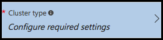

        * On the Cluster configuration blade, set the Cluster type to **R Server** and the Version to R Server **9.1 (HDI 3.6)**

        * Check the box next to **R Studio community edition for R Server**. Note that the Operating System option for the Spark cluster is fixed to Linux

            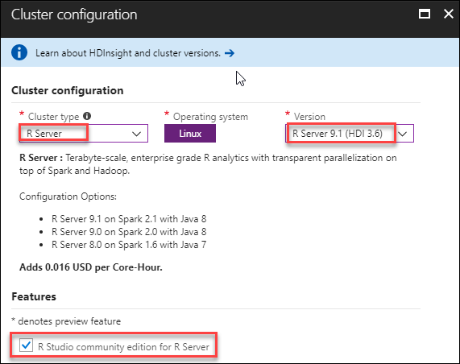

        * Select **Select** to close the Cluster configuration blade

    * **Cluster login username**: Leave as admin

    * **Cluster login password**: Enter Password.1!!

    * **Secure Shell (SSH) username**: Set to remoteuser (**this is required**)

    * **Use same password as cluster login**: Ensure the checkbox is checked

    * **Resource group**: Choose Use existing, and select the hands-on-lab-SUFFIX resource group

    * **Location**: Select the location you are using for resources in this hands-on lab

        

    * Select **Next** to move on to the storage settings

4. On the Storage blade:

    * **Primary storage type**: Leave set to Azure Storage

    * **Selection Method**: Leave set to My subscriptions

    * **Select a Storage account**: Select Create new, and enter a unique name for the storage account, such as labstorageSUFFIX

    * **Default container**: Set to the *name of your cluster*

    * **Additional storage accounts**: Leave unconfigured.

    * **Data Lake Store access**: Leave unconfigured.

    * **Metastore Settings**: Leave blank.

        

    * Select **Next** to move on to the Cluster summary.

5. On the Cluster Summary blade, select Edit next to Cluster Size.

    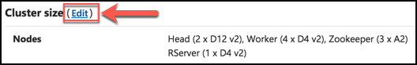

6. On the Cluster size blade, enter the following:

    * **Number of worker nodes**: Enter 2

    * **Worker node size**: Select D12 v2, then select Select

    * **Head node size**: Select D12 v2, then select Select

    * **Zookeeper node sizes**: Leave set to A2

    * **R-Server edge node size**: Select D12 v2, then select Select

        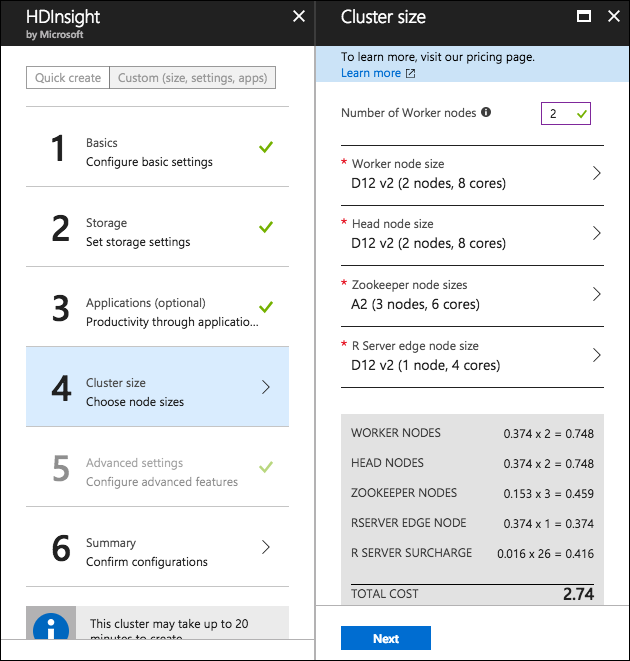

    * Select **Next**.

7. Select **Next** on the Advanced settings blade to move to the Cluster summary blade.

8. Select **Create** on the Cluster summary blade to create the cluster.

9. It will take approximately 20 minutes to create you cluster. You can move on to the steps below while the cluster is provisioning.

## Task 2: Setup a lab virtual machine (VM)

1. In the [Azure portal](https://portal.azure.com/), select **+Create a resource**, enter "visual studio community" into the Search the Marketplace box, select **Visual Studio Community 2017 (latest release) on Windows Server 2016 (x64)** from the results, and select **Create**.

    

2. Set the following configuration on the Basics tab.

    * **Name**: Enter LabVM

    * **VM disk type**: Select SSD

    * **User name**: Enter demouser

    * **Password**: Enter Password.1!!

    * **Subscription**: Select the same subscription you are using for this hands-on lab

    * **Resource Group**: Select Use existing, and select the hands-on-lab-SUFFIX resource group

    * **Location**: Select the location you are using for resources in this hands-on lab

        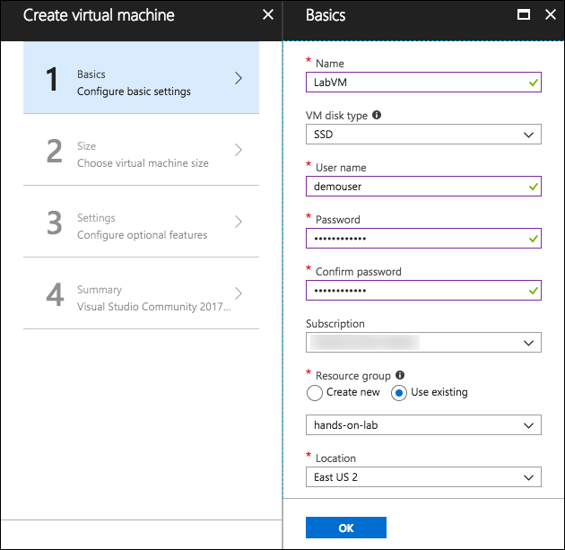

    * Select **OK** to move to the next step.

3. On the Choose a size blade, ensure the Supported disk type is set to SSD, and select View all. This machine won't be doing much heavy lifting, so selecting DS2_V3 Standard is a good baseline option.

    

4. Select **Select** to move on to the Settings blade.

5. Accept all the default values on the Settings blade, and select **OK**.

6. Select **Create** on the Create blade to provision the virtual machine.

7. It may take 10+ minutes for the virtual machine to complete provisioning.

## Task 3: Install Power BI Desktop on the lab VM

1. Connect to the **LabVM**. (If you are already connected to your Lab VM, skip to Step 7.)

2. From the left side menu in the Azure portal, click on Resource groups, then enter your resource group name into the filter box, and select it from the list.

    

3. Next, select your lab virtual machine, LabVM, from the list.

    

4. On your Lab VM blade, select Connect from the top menu.

    

5. Download and open the RDP file.

6. Select **Connect**, and enter the following credentials:

    a. User name: **demouser**

    b. Password: **Password.1!!**

7. Once logged in, launch the **Server Manager**. This should start automatically, but you can access it via the Start menu if it does not start.

8. Select **Local Server**, then select **On** next to **IE Enhanced Security Configuration**.

    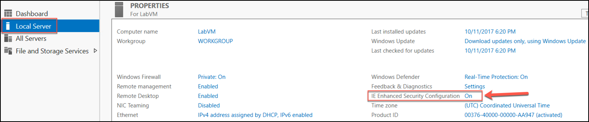

9. In the Internet Explorer Enhanced Security Configuration dialog, select **Off under Administrators**, then select **OK**.

    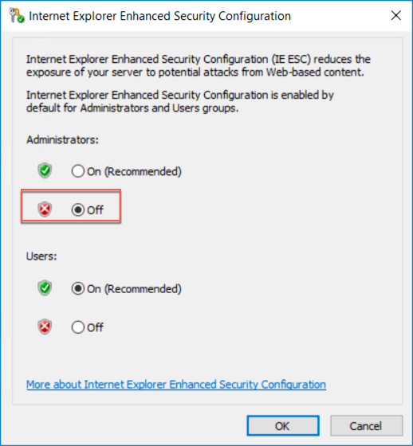

10. Close the Server Manager.

11. In a web browser on the Lab VM navigate to the [Power BI Desktop download page](https://www.microsoft.com/en-us/download/details.aspx?id=45331)

12. Select the **Download Free** link in the middle of the page.

    

13. Select the **x64 bit version** of the download, then select **Next**.

    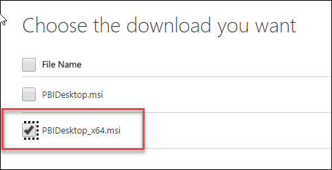

14. Run the installer once it downloads.

15. Select Next on the welcome screen.

    

16. Accept the license agreement, and select Next.

    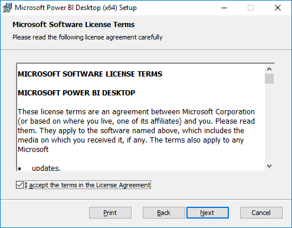

17. Leave the default destination folder, and select Next.

    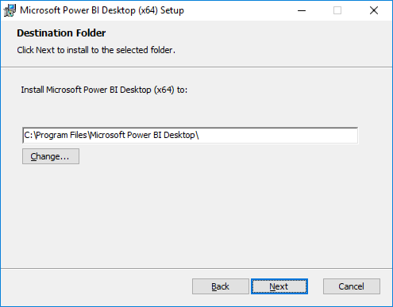

18. Make sure the Create a desktop shortcut box is checked, and select Install.

    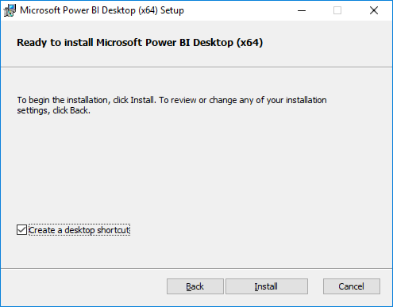

19. Uncheck Launch Microsoft Power BI Desktop, and select Finish.

    

## Task 4: Prepare an SSH client

In this task, you will download, install, and prepare the Git Bash SSH client that you will use to access your HDInsight cluster from your Lab VM.

1. On your Lab VM, open a browser, and navigate to <https://git-scm.com/downloads> to download Git Bash.

    

2. Select the download for your OS, and then select the Download button.

3. Run the downloaded installer, select Next on each screen to accept the defaults.

4. When the install is complete, you will be presented with the following screen:

    

5. Check the Launch Git Bash checkbox, and uncheck View Release Notes. Select **Finish**.

6. The Git Bash client should open in a new window.

7. At the command prompt, enter **ssh remoteuser@\<clustername\>-ssh.azurehdinsight.net**, replacing \<clustername\> with the name of the HDInsight cluster created in [Task 1](#task-1-provision-an-r-server-on-hdinsight-with-spark-cluster) above.

    > Note: You will need to wait for the cluster deployment to complete in Azure before you can complete this step.

    

8. Respond to any prompts in the SSH window, and enter the password for **remoteuser** when prompted.

9. Use Git Bash for SSH during the hands-on lab for any instructions requiring an SSH connection. You can repeat these steps any time to re-connect.

## Task 5: Install R Tools for Visual Studio 2017

1. Run the Visual Studio installer using Start, Run, C:\\Program Files (x86)\\Microsoft Visual Studio\\Installer\\vs\_installer.exe.

    

2. Once the Installer starts, click **Update**. This will take some time to complete and require a reboot.

    

3. Once the update is complete and the VM has restarted, run the installer again. Run the Visual Studio installer using Start, Run, C:\\Program Files (x86)\\Microsoft Visual Studio\\Installer\\vs\_installer.exe.

4. Next select the **Modify** option.

    

5. Select the Data science and analytical applications workload and then click Modify.

    

## Task 6: Download and open the vending machines starter project

Trey Research has provided a starter solution for you. They have asked you to use this as the starting point for creating the Vending Machines solution in Azure.

1. From your LabVM, download the starter project from [here](http://bit.ly/2w6t2qz).

2. Unzip the contents to the folder **C:\\VendingMachines\\.**

3. Open **VendingMachines.sln** with Visual Studio 2017.

4. Sign in to Visual Studio or create an account, if prompted.

5. If the Security Warning for Simulator window appears, **uncheck Ask me for every project in this solution**, and select **OK**.

    

**Note**: If you attempt to build the solution at this point, you will see many build errors. This is intentional. You will correct these in the exercises that follow.

## Task 7: Provision IoT Hub

In these steps, you will provision an instance of IoT Hub.

1. In your browser, navigate to the [Azure portal](https://portal.azure.com).

2. Select **+Create a resource**, then select Internet of Things, and select IoT Hub.

    

3. In the IoT Hub blade, enter the following:

    * Name: Provide a name for your new IoT Hub, such as **vendingmachingshub**

    * Pricing and scale tier: **Select S1 Standard**

    * IoT Hub units: **Set to 1**

    * Device-to-cloud partitions: **Select 4 partitions.**

    * Subscription: Select the same subscription you've been using for previous resources in this lab.

    * Resource group: Select Use existing, and select the **ivmhandsonlab** resource group you created previously.

    * Location: Select the location you used previously.

    * Select **Create**.

        

4. When the IoT Hub deployment is completed, you will receive a notification in the Azure portal. Select **Go** to resource in the notification.

    

5. From the IoT Hub's Overview blade, select **Shared access policies** under Settings on the left-hand menu.

    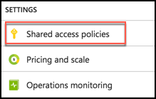

6. Select **iothubowner** policy.

    

7. In the **iothubowner** blade, select the Copy button to the right of the Connection string - primary key field. Paste the connection string value into a text editor, such as Notepad, as this will be needed later in this lab.

    

## Task 8: Create Microsoft Machine Learning Server on Linux

In these steps, you will provision and configure a Virtual Machine running Microsoft Machine Learning Server. You will use this machine to host the R Server Operationalization service.

1. Within the Azure Portal, select **+Create a resource**, then type **Machine Learning Server** into the Search field.

2. In the results list, select **Microsoft Machine Learning Server 9.3.0 on Ubuntu 16.04**.

    

3. On the blade that appears, select **Create.**

4. In the Basics blade, enter:

    * Name: Enter a **unique name** for the server.

    * User name: Enter **radmin**.

    * Authentication type: Select **Password**.

    * Password: Enter and confirm the password, **Password.1!!**

    * Subscription: Select the subscription you've been using for this lab.

    * Resource group: Select **Use existing**, and select the Resource Group you created earlier.

    * Location: Select the same location used previously.

    * Select OK to move on to choosing a VM size.

        

5. On the Choose a size blade, select **E2S\_V3 Standard**, and click **Select**.

    

6. On the Settings blade, select **Network security group** (firewall).

    * Click **Create new** under Choose network security group.

    * Enter a name, such as **my-r-nsg**.

    * Select **+Add** **an inbound rule**.

    

    * Select **Custom** under Service and enter the following:

        i. Port range: **12800**

        ii. Priority: **100**

        iii. Name: **Port\_12800** (should be auto-generated)

        iv. Select **OK**

        

7. Select **OK** on the Create network security group blade.

8. Select **OK** on the Settings blade.

9. Select Create on the Summary blade.

    

10. Once the machine has provisioned you will need to perform some configurations. On top of the Overview blade of the new server, select Connect, then copy the SSH command.

    

11. Using a new Git Bash window on your Lab VM, SSH into your Microsoft Machine Learning Server VM by pasting the SSH command you copied above at the command prompt. For example:\
    **ssh radmin@\<your-server-ip\>.**

12. When prompted if you want to continue connecting, enter **yes**.

13. Enter your password, **Password.1!!**

14. At the prompt, after successfully logging in, enter the following command: **sudo apt-get update -y**

15. Type **exit** twice to disconnect from the ssh session.

## Task 9: Create Storage Account

In these steps, you will provision a storage account that will be used for storing photos sent from the vending machine simulator and for the storage of the promotional package resources.

1. Using the Azure Portal, select **+Create a resource**, **Storage**, then select **Storage account**.

    

2. On the Create storage account blade, enter the following values:

    * Name: Enter a **unique name** for the storage account.

    * Deployment model: Leave **Resource Manager** selected.

    * Account kind: Leave set at **General purpose**.

    * Performance: Leave set to **Standard**.

    * Replication: Set to **Locally-redundant storage (LRS).**

    * Storage service encryption: Leave as **Disabled**.

    * Subscription: Select your Subscription.

    * Resource group: Select the Use existing radio button, and select **ivmhandsonlab** from the resource group list.

    * Location: Select a Location to be consistent with the other resources you have created.

    * Virtual networks : Leave set to **Disabled.**

    * Select Create.

        

3. Navigate to the newly created storage account in the Azure Portal by clicking on Storage Accounts, and selecting it from the list of available storage accounts.

4. On the Storage account blade, select Blobs.

    

5. In the Blob service blade, select **+Container** from the command bar.

    

6. On the New container blade, set the name to "**photos**" and select **Private** as the Access type.

    

7. Click **OK**.

8. Repeat steps 6-8 to create another container named "**promo**".

9. You should now see both containers listed on the Blob service blade.

    

10. Close the Blob service blade to go back to the Storage blade. Select **Access Keys** from the left-hand menu.

    

11. Use the copy button to the right of the Connection String for key1 to copy your storage connection string. Save the copied value to a text editor, such as Notepad, as this will be used later on.

    

12. Open Visual Studio and from the **View Menu** select **Cloud Explorer**.

    

    > Note: You may need to select your subscription, but clicking the person icon and expanding the subscriptions.

13. Expand the **Storage account** that you just created, and the **Blob Containers** item underneath it.

    

14. Right-click the promo container and select Open.

    

15. Select the Upload blob button.

    

16. Select **Browse**.

17. In the dialog, select the three images **CoconutWater.png, Water.png, and Soda.png** from the starter solution **Simulator\\Images** folder and select **Open**.

18. Select **OK** on the Upload New File Dialog to upload the images to the container.

    

## Task 10: Provision Cognitive Services Face API

To provision access to the Face API (which provides demographic information about photos of human subjects), you will need to provision a Cognitive Services account.

1. In the Azure Portal, select **+Create a resource, AI + Cognitive Services,** and select **Face API**.

    

2. On the Create Face API blade:

    * Name: Enter a name.

    * Subscription: Choose your Subscription.

    * Location: Choose the location you've been using for other resources in this lab.

    * Pricing tier: Select the **Free tier (F0)** from the drop-down list.

    * Resource group: Select Use existing, and select the **ivmhandsonlab** resource group from the list.

    * Check the box confirming you have read and understand the legal terms.

    * Click Create to provision the Cognitive Services account.

        

3. When the Face API finishes provisioning, browse to the Cognitive Services Face API by clicking on Go to resource in the Deployment succeeded notification.

    

4. On top of the Cognitive Services overview blade, click the Copy button to the right of the Endpoint. Paste this value into a text editor, such as Notepad, for later use.

    

5. In the Cognitive Services blade, click on Keys under the Resource Management heading.

    

6. Click the Copy button next to the value for Key 1. Paste this value into a text editor, such as Notepad, for later use.

    

## Task 11: Provision SQL Database

In these steps, you will provision a SQL database to support the transactions and real-time analytics.

1. In the Azure Portal, select **+Create a resource**, select **Databases**, then select **SQL Database**.

    

2. In the SQL Database blade, enter the following:

    * Database name: Enter **vending**.

    * Subscription: Choose your Subscription.

    * Resource Group: Select Use existing, and choose **ivmhandsonlab** from the resource group list.

    * Source: Leave source as **Blank** database.

    * Server: Select **configure required settings**

        i. Server name: Enter a unique server name

        ii. User name: Enter **demouser**

        iii. Password: Enter **Password.1!!**

        iv. Location: Select the same location you've used for other resources in this lab.

        v. Click Select.

        

    * Want to use SQL elastic pool: Leave set to Not now.

    * Change the Pricing tier to **Premium P1**, and select Apply. Premium tier is required for Columnar indexes.

        

    * Collation: Leave set to the default value (SQL\_Latin1\_General\_CP1\_CI\_AS).

    * Select **Create**.

        

3. Once the SQL Database finishes provisioning, navigate to the database in the Azure portal and select the Show database connection strings near the top of the Overview blade.

    

4. Copy the connection string on the ADO.NET tab of the Database connection string blade, and paste the value into a text editor, such as Notepad, for later reference.

    

*These steps should be completed prior to starting the rest of the Lab.*

Return to [Hands-on lab readme](./readme.md)