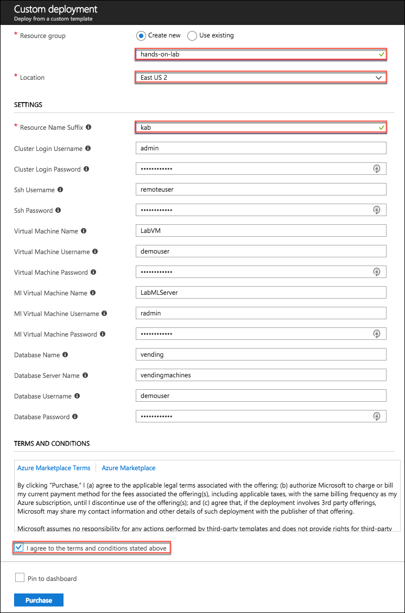
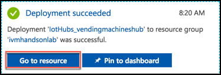
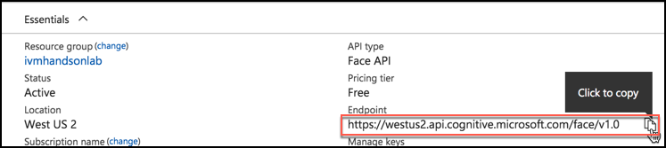

# Before the hands-on lab

Duration: 45 minutes

In the Before the Hands-on Lab exercise, you will set up your environment for use in the rest of the hands-on lab. You should follow all the steps provided in the Before the Hands-on Lab section to prepare your environment **before attending** the hands-on lab. Failure to do so will significantly impact your ability to complete the lab within the time allowed.

> IMPORTANT: Most Azure resources require unique names. Throughout this lab you will see the word “SUFFIX” as part of resource names. You should replace this with your Microsoft alias, initials, or another value to ensure the resource is uniquely named.

## Contents

* [Task 1: Execute ARM template to provision Azure resources](#task-1-execute-arm-template-to-provision-azure-resources)
* [Task 2: Connect to your Lab VM](#task-2-connect-to-your-lab-vm)
* [Task 3: Confirm installation of R Tools for Visual Studio 2017](#task-3-confirm-installation-of-r-tools-for-visual-studio-2017)
* [Task 4: Download and open the vending machines starter project](#task-4-download-and-open-the-vending-machines-starter-project)

## Task 1: Execute ARM template to provision Azure resources

In this task, you will run an Azure Resource Manager (ARM) template to provision many of the Azure resources you will be using throughout this lab. The ARM template uses a PowerShell script to provision the following resources, and install software on the Lab VM:

* R Server on HDInsight cluster
* Windows Server 2016 (x64) virtual machine with the following software installed:
  * Visual Studio Community 2017
  * Power BI Desktop
  * Windows Subsystem for Linux (WSL)
  * R Tools for Visual Studio 2017 (RTVS)
* Microsoft Machine Learning Server on Linux
* Azure storage account for storing photos

> Note: If you want to review the steps for manually creating the resources provisioned by the ARM template, see [Appendix A](./appendix.md).

1. Select the **Deploy to Azure** button below to launch the script in a Custom deployment blade in the Azure portal.

    

2. On the Custom deployment blade, enter the following:
    * **Subscription**: Select the subscription you are using for this hands on lab
    * **Resource group**: Choose Create new and enter hands-on-lab-SUFFIX as the resource group name
    * **Location**: Select the region you would like to use for resources in this hands-on lab. Remember this location so you can use it for the other resources you'll provision throughout this lab
    * **Resource Name Suffix**: Enter a unique suffix, such as your initials or Microsoft alias, to use for uniquely naming resources created by the ARM template
    * Leave the default values for the remaining resources, but note the values for later reference:
        * **Cluster Login User Name**: admin
        * **SSH User Name**: remoteuser
        * **Virtual Machine Username**: demouser
        * **ML Virtual Machine Username**: radmin
        * All usernames use the password **Password.1!!**

        

3. Select **Purchase**.

> It typically takes 15 - 20 minutes for the ARM template deployment to finish.

## Task 2: Connect to your Lab VM

In this task, you will create an RDP connection to your Lab virtual machine (VM), which is the Windows Server 2016 (x64) VM provisioned by the ARM template.

1. In the [Azure portal](https://portal.azure.com), select Resource groups in the Azure navigation pane, enter your resource group name (hands-on-lab-SUFFIX) into the filter box, and select it from the list.

    

2. In the list of resources for your resource group, select the LabVM Virtual Machine.

    

3. On your Lab VM blade, select Connect from the top menu.

    

4. Select **Download RDP file**, then open the downloaded RDP file.

    

5. Select **Connect** on the Remote Desktop Connection dialog.

    

6. Enter the following credentials when prompted:

    a. **User name**: demouser

    b. **Password**: Password.1!!

7. Select **Yes** to connect, if prompted that the identity of the remote computer cannot be verified.

    

8. Once logged in, launch the **Server Manager**. This should start automatically, but you can access it via the Start menu if it does not start.

    

9. Select **Local Server**, then select **On** next to **IE Enhanced Security Configuration**.

    

10. In the Internet Explorer Enhanced Security Configuration dialog, select **Off under Administrators**, then select **OK**.

    

11. Close the Server Manager.

## Task 3: Confirm installation of R Tools for Visual Studio 2017

In this task, you will confirm that R Tools for Visual Studio 2017 (RTVS) was successfully installed by the ARM template.

1. Launch the Visual Studio Installer by select Search on the Windows task bar, entering "visual studio installer" into the search box, and selecting Visual Studio Installer for the results.

    

2. Update the Visual Studio Installer, if prompted.

3. Once the Installer starts, select **More**, then select **Modify**.

    

    > Note: If the Visual Studio installation is up to date, Modify may appear where the Update button is in the following screenshot. If you wish to update Visual Studio first, select Update. This is not necessary for this hands-on lab, and the operation can take 30 minutes or more to complete.

4. Verify that the **Data science and analytical applications** workload is selected, indicated by a checked box in the upper right corner of the workload. If it is not, select the workload and select **Modify**.

    

## Task 4: Download and open the vending machines starter project

Trey Research has provided a starter solution for you. They have asked you to use this as the starting point for creating the Vending Machines solution in Azure.

1. From your LabVM, download the starter project from [here](http://bit.ly/2w6t2qz).

2. Unzip the contents to the folder **C:\\VendingMachines\\.**

3. Open **VendingMachines.sln** with Visual Studio 2017.

4. If prompted, select Visual Studio 2017 from the Microsoft Visual Studio Version Selector.

    

5. Sign in to Visual Studio or create an account, if prompted.

6. If the Security Warning for Simulator window appears, **uncheck Ask me for every project in this solution**, and select **OK**.

    

> Note: If you attempt to build the solution at this point, you will see many build errors. This is intentional. You will correct these in the exercises that follow.

## Task 5: Setup Photos Storage Account containers

In these steps, you will provision a storage account that will be used for storing photos sent from the vending machine simulator and for the storage of the promotional package resources.

1. Navigate to the newly created storage account in the Azure Portal by clicking on Storage Accounts, and selecting it from the list of available storage accounts.

4. On the Storage account blade, select Blobs.

    

5. In the Blob service blade, select **+Container** from the command bar.

    

6. On the New container blade, set the name to "**photos**" and select **Private** as the Access type.

    

7. Click **OK**.

8. Repeat steps 6-8 to create another container named "**promo**".

9. You should now see both containers listed on the Blob service blade.

    

10. Close the Blob service blade to go back to the Storage blade. Select **Access Keys** from the left-hand menu.

    

11. Use the copy button to the right of the Connection String for key1 to copy your storage connection string. Save the copied value to a text editor, such as Notepad, as this will be used later on.

    

12. Open Visual Studio and from the **View Menu** select **Cloud Explorer**.

    

    > Note: You may need to select your subscription, but clicking the person icon and expanding the subscriptions.

13. Expand the **Storage account** that you just created, and the **Blob Containers** item underneath it.

    

14. Right-click the promo container and select Open.

    

15. Select the Upload blob button.

    

16. Select **Browse**.

17. In the dialog, select the three images **CoconutWater.png, Water.png, and Soda.png** from the starter solution **Simulator\\Images** folder and select **Open**.

18. Select **OK** on the Upload New File Dialog to upload the images to the container.

    

*These steps should be completed prior to starting the rest of the Lab.*

Return to [Hands-on lab readme](./readme.md)

TODO: Move these tasks into the main step-by-step, where they are actually used.

## Task 5: Install an SSH shell

In this task, you will download and install the Git Bash SSH client. You will use this to access your HDInsight cluster from your Lab VM.

6. Launch Git Bash on your Lab VM.

8. At the command prompt, enter **ssh remoteuser@\<clustername\>-ssh.azurehdinsight.net**, replacing \<clustername\> with the name of the HDInsight cluster created in [Task 1](#task-1-provision-an-r-server-on-hdinsight-with-spark-cluster) above.

    > Note: You will need to wait for the cluster deployment to complete in Azure before you can complete this step.

    

9. Respond to any prompts in the SSH window, and enter the password for **remoteuser** when prompted.

10. Use Git Bash for SSH during the hands-on lab for any instructions requiring an SSH connection. You can repeat these steps any time to re-connect.

* [Task 8: Provision IoT Hub](#task-8-provision-iot-hub)
* [Task 11: Provision Cognitive Services Face API](#task-11-provision-cognitive-services-face-api)

## Task 7: Provision IoT Hub

In these steps, you will provision an instance of IoT Hub.

1. In your browser, navigate to the [Azure portal](https://portal.azure.com).

2. Select **+Create a resource**, then select Internet of Things, and select IoT Hub.

    

3. In the IoT Hub blade, enter the following:

    * Name: Provide a name for your new IoT Hub, such as **vendingmachingshub**

    * Pricing and scale tier: **Select S1 Standard**

    * IoT Hub units: **Set to 1**

    * Device-to-cloud partitions: **Select 4 partitions.**

    * Subscription: Select the same subscription you've been using for previous resources in this lab.

    * Resource group: Select Use existing, and select the **ivmhandsonlab** resource group you created previously.

    * Location: Select the location you used previously.

    * Select **Create**.

        

4. When the IoT Hub deployment is completed, you will receive a notification in the Azure portal. Select **Go** to resource in the notification.

    

5. From the IoT Hub's Overview blade, select **Shared access policies** under Settings on the left-hand menu.

    

6. Select **iothubowner** policy.

    

7. In the **iothubowner** blade, select the Copy button to the right of the Connection string - primary key field. Paste the connection string value into a text editor, such as Notepad, as this will be needed later in this lab.

    

## Task 8: Configure Microsoft Machine Learning Server on Linux

8. Once the machine has provisioned you will need to perform some configurations. On top of the Overview blade of the new server, select Connect, then copy the SSH command.

    

9. Using a new Git Bash window on your Lab VM, SSH into your Microsoft Machine Learning Server VM by pasting the SSH command you copied above at the command prompt. For example:\
    **ssh radmin@\<your-server-ip\>.**

10. When prompted if you want to continue connecting, enter **yes**.

11. Enter your password, **Password.1!!**

12. At the prompt, after successfully logging in, enter the following command: **sudo apt-get update -y**

13. Type **exit** twice to disconnect from the ssh session.

## Task 10: Provision Cognitive Services Face API

To provision access to the Face API (which provides demographic information about photos of human subjects), you will need to provision a Cognitive Services account.

1. In the Azure Portal, select **+Create a resource, AI + Cognitive Services,** and select **Face API**.

    

2. On the Create Face API blade:

    * Name: Enter a name.

    * Subscription: Choose your Subscription.

    * Location: Choose the location you've been using for other resources in this lab.

    * Pricing tier: Select the **Free tier (F0)** from the drop-down list.

    * Resource group: Select Use existing, and select the **ivmhandsonlab** resource group from the list.

    * Check the box confirming you have read and understand the legal terms.

    * Click Create to provision the Cognitive Services account.

        

3. When the Face API finishes provisioning, browse to the Cognitive Services Face API by clicking on Go to resource in the Deployment succeeded notification.

    

4. On top of the Cognitive Services overview blade, click the Copy button to the right of the Endpoint. Paste this value into a text editor, such as Notepad, for later use.

    

5. In the Cognitive Services blade, click on Keys under the Resource Management heading.

    

6. Click the Copy button next to the value for Key 1. Paste this value into a text editor, such as Notepad, for later use.

    

## Task 11: Get SQL Database connection string

3. Once the SQL Database finishes provisioning, navigate to the database in the Azure portal and select the Show database connection strings near the top of the Overview blade.

    

4. Copy the connection string on the ADO.NET tab of the Database connection string blade, and paste the value into a text editor, such as Notepad, for later reference.

    