[Legal notice](../legal.md)

Updated May 2018

# Intelligent vending machines hands-on lab step-by-step

If you have not yet completed the steps to set up your environment in [Before the hands-on lab](./Setup.md), you will need to do that before proceeding.

## Contents

* [Exercise 1: Create Dynamic Pricing Model](#exercise-1-create-dynamic-pricing-model)
  * [Task 1: Create a model locally](#task-1-create-a-model-locally)
  * [Task 2: Try a prediction locally](#task-2-try-a-prediction-locally)
  * [Task 3: Create the model in R Server on HDInsight](#task-3-create-the-model-in-r-server-on-hdinsight)
  * [Task 4: Create predictive service in R Server Operationalization](#task-4-create-predictive-service-in-r-server-operationalization)
* [Exercise 3: Implement dynamic pricing](#exercise-3-implement-dynamic-pricing)
  * [Task 1: Implement photo uploads to Azure Storage](#task-1-implement-photo-uploads-to-azure-storage)
  * [Task 2: Provision Cognitive Services Face API](#task-2-provision-cognitive-services-face-api)
  * [Task 3: Invoke Face API](#task-3-invoke-face-api)
  * [Task 4: Invoke pricing model](#task-4-invoke-pricing-model)
  * [Task 5: Configure the Simulator](#task-5-configure-the-simulator)
  * [Task 6: Test dynamic pricing in Simulator](#task-6-test-dynamic-pricing-in-simulator)
* [Exercise 4: Implement purchasing](#exercise-4-implement-purchasing)
  * [Task 1: Create the transactions table](#task-1-create-the-transactions-table)
  * [Task 2: Configure the Simulator](#task-2-configure-the-simulator)
  * [Task 3: Test purchasing](#task-3-test-purchasing)
* [Exercise 5: Implement device command and control](#exercise-5-implement-device-command-and-control)
  * [Task 1: Listen for control messages](#task-1-listen-for-control-messages)
  * [Task 2: Send control messages](#task-2-send-control-messages)
  * [Task 3: Configure the DeviceControlConsole and the Simulator](#task-3-configure-the-devicecontrolconsole-and-the-simulator)
  * [Exercise 6: Analytics with Power BI Desktop](#exercise-6-analytics-with-power-bi-desktop)
  * [Task 1: Build the query and create the visualization](#task-1-build-the-query-and-create-the-visualization)

> Start of steps without a current home

TODO: Figure out where we actually need the Storage account connection string, and move these two steps there.

8. Close the Blob service blade to go back to the Storage account blade. Select **Access Keys** from the left-hand menu.

    

9. Use the copy button to the right of the Connection String for key1 to copy your storage connection string. Save the copied value to a text editor, such as Notepad, as this will be used later on.

    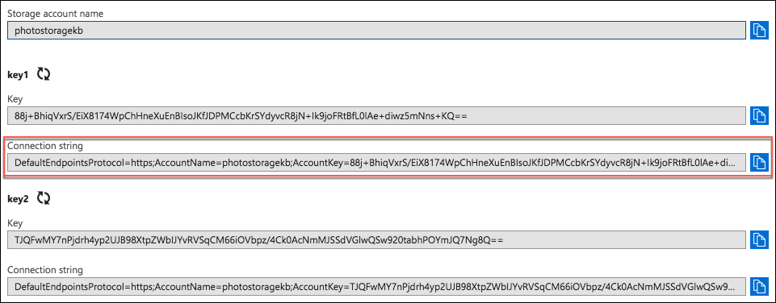


TODO: Move these tasks into the main step-by-step, where they are actually used.
* [Task 7: Provision IoT Hub](#task-7-provision-iot-hub)

## Task 7: Provision IoT Hub

In these steps, you will provision an instance of IoT Hub.

1. In your browser, navigate to the [Azure portal](https://portal.azure.com).

2. Select **+Create a resource**, then select Internet of Things, and select IoT Hub.

    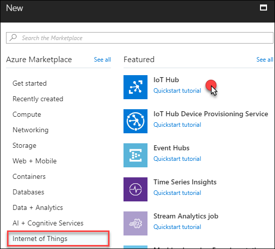

3. In the IoT Hub blade, enter the following:

    * Name: Provide a name for your new IoT Hub, such as **vendingmachingshub**

    * Pricing and scale tier: **Select S1 Standard**

    * IoT Hub units: **Set to 1**

    * Device-to-cloud partitions: **Select 4 partitions.**

    * Subscription: Select the same subscription you've been using for previous resources in this lab.

    * Resource group: Select Use existing, and select the **ivmhandsonlab** resource group you created previously.

    * Location: Select the location you used previously.

    * Select **Create**.

        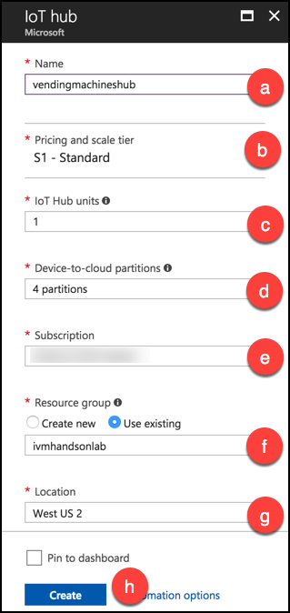

4. When the IoT Hub deployment is completed, you will receive a notification in the Azure portal. Select **Go** to resource in the notification.

    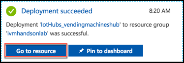

5. From the IoT Hub's Overview blade, select **Shared access policies** under Settings on the left-hand menu.

    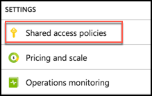

6. Select **iothubowner** policy.

    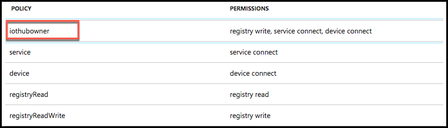

7. In the **iothubowner** blade, select the Copy button to the right of the Connection string - primary key field. Paste the connection string value into a text editor, such as Notepad, as this will be needed later in this lab.

    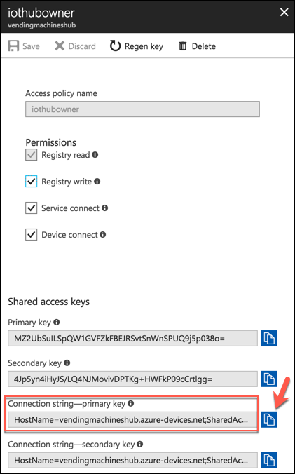

## Task 11: Get SQL Database connection string

1. Once the SQL Database finishes provisioning, navigate to the database in the Azure portal and select the Show database connection strings near the top of the Overview blade.

    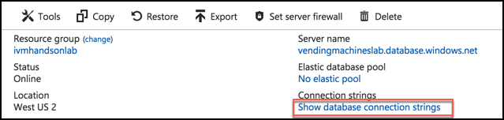

2. Copy the connection string on the ADO.NET tab of the Database connection string blade, and paste the value into a text editor, such as Notepad, for later reference.

    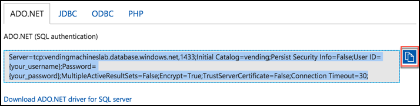

> End of steps without a current home

## Exercise 1: Create Dynamic Pricing Model

Duration: 45 minutes

In this exercise, you will create a machine learning model that predicts the purchase price for an item sold by the vending machine, provided the demographics of the customer and the item. You will then operationalize this model by exposing it as a web service hosted in Azure Machine Learning, and test it out.

### Task 1: Create a model locally

1. Within Visual Studio Solution Explorer, expand the **PricingModel** project and open the file `TrainModel.R` by double-clicking on the file in the Solution Explorer.

    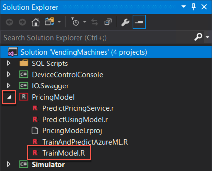

2. Read the script. The top portion, entitled Create Sample Data, has been provided for you and you will generate the sample data you will use to train your model.

3. Highlight all the text between the "Create Sample Data" and "END Create Sample Data" comments.

4. Right-click the selected text and select **Execute In Interactive**.

    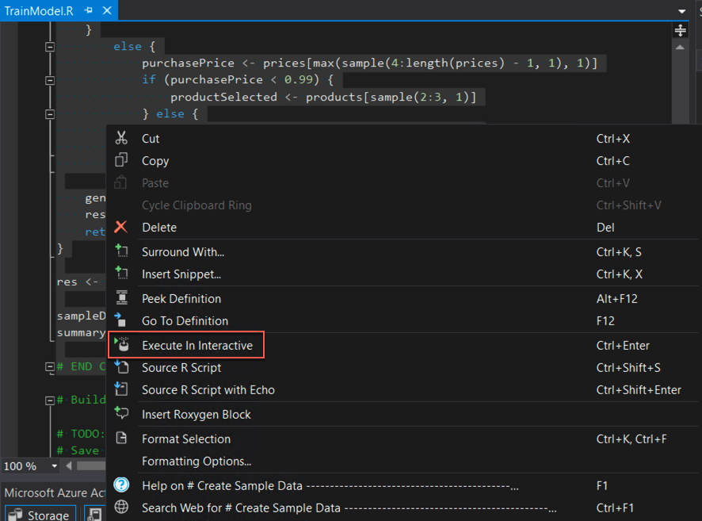

5. You should see it execute in the R Interactive Window, ending with a summary of the created data.

    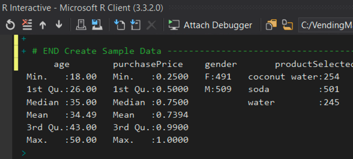

6. From the R Tools menu, select Windows and Variable Explorer.

    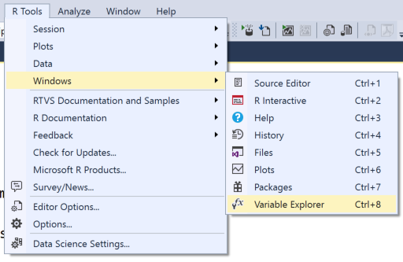

7. Expand the variable **sampleData**, and explore the structure of the created data.

    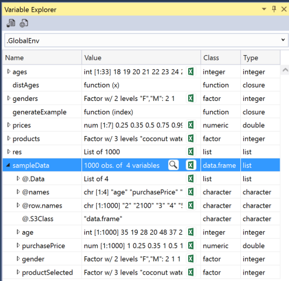

8. Now save this sampleData to a file by replacing TODO 1 in the `TrainModel.R` script with the following code:

    ```csharp
    # TODO: 1. Export the sample data to a file
    save(sampleData, file = "sampleData.RData")
    ```

9. Highlight the **save line**, and select **Execute In Interactive**.

10. Open File Explorer and navigate to the location of the **PricingModel** (C:\\VendingMachines\\VendingMachines - Clean\\PricingModel) project on disk. You should see the file `sampleData.RData` on disk.

    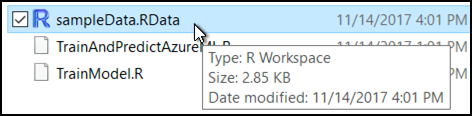

11. Back in the `TrainModel.R` file in Visual Studio, replace TODO 2 with the following code that builds the model using a Linear Regression.

    ```csharp
    # TODO: 2. Build a linear regression model to predict purchase price given age, gender and # productSelect
    pricingModel <- rxLinMod(purchasePrice ~ age + gender + productSelected, data = sampleData)
    ```

12. Save that trained model to disk by replacing TODO 3 with:

    ```csharp
    # TODO: 3. Export the trained model to a file named pricingModel.rda
    save(pricingModel, file = "pricingModel.RData")
    ```

13. Finally, save the first row of the sample data to a file so you can re-use the structure later when operationalizing the model. Replace TODO 4 with:

    ```csharp
    # TODO: 4. Save one example of the sample data to serve as an input template, to a file     # called inputExample.rda
    inputExample <- sampleData[1,]
    save(inputExample, file = "inputExample.RData")
    ```

14. Save your changes to `TrainModel.R`.

15. Highlight TODO items 2 through 4 and execute them in interactive.

16. In the same folder as your script, you should now have the files `sampleData.RData`, `pricingModel.RData`, and `inputExample.RData`.

    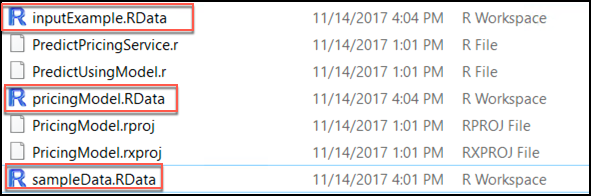

### Task 2: Try a prediction locally

1. Within Visual Studio, open `PredictUsingModel.r` under the Pricing Model project in Solution Explorer.

2. Replace TODO 1 with the following:

    ```csharp
    # TODO: 1. Prepare the input to use for prediction
    inputExample[1,]$age <- 30
    inputExample[1,]$gender <- "F"
    inputExample[1,]$productSelected <- "coconut water"
    ```

3. Replace TODO 2 with the following:
    
    ```csharp
    # TODO: 2. Execute the prediction
    prediction <- rxPredict(pricingModel, data = inputExample)
    ```

4. Highlight all the script in the file and execute it in interactive.

5. Using Variable Explorer, expand the prediction variable and observe the price the model suggested to use for purchasing the coconut water for input of a 30-year-old female.

    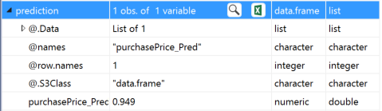

### Task 3: Create the model in R Server on HDInsight

1. On your Lab VM, open a Git Bash shell from the start menu.

2. At the command prompt, enter the following command:

    ```bash
    ssh remoteuser@\<clustername\>-ssh.azurehdinsight.net
    ```

    > Replace \<clustername\> with the name of your HDInsight cluster.

    > Note: You will need to wait for the cluster deployment to complete in Azure before you can complete this step.

    

9. Respond to any prompts in the SSH window, and enter the password for **remoteuser** when prompted.

10. Use Git Bash for SSH during the hands-on lab for any instructions requiring an SSH connection. You can repeat these steps any time to re-connect.

2. SSH into your deployed R Server in HDInsight cluster. (You can get the SSH connection string for your cluster from the HDInsight Blade in the Azure Portal). 

    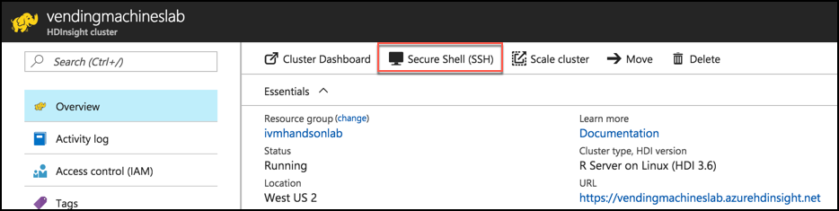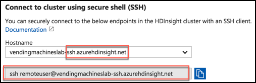

3. If prompted to continue connecting, enter yes.

4. Enter your password.

5. At the command prompt, type **R** to load the R shell (be sure to use a capital letter "R").

6. Run the following command to create a spark context for R:
    ```
    sparkCluster <- RxSpark()
    rxSetComputeContext(sparkCluster)
    ```

7. In Visual Studio, open **TrainModel.r**, and copy the entire script.

8. Paste the script in the R shell, and press ENTER. (You may need to press ENTER a few times until you get to the last line of the script.)

9. When the script has finished executing, type the following:
    ```
    dir()
    ```

10. You should see it list the three files created by the script, as follows:\
    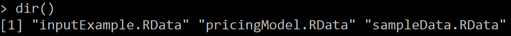

11. Now, copy those files from local storage to Blob storage by using the Hadoop File System. First, create a folder in which to store your output.
    ```
    modelExportDir <- "/models"
    rxHadoopMakeDir(modelExportDir)
    ```

12. List the contents of the root ("/") directory, and confirm your "**/models**" folder has been created. Notice that the list you are looking at is folders directly underneath the container in Azure Storage that was created with your cluster.
    ```
    rxHadoopListFiles("/")
    ```

    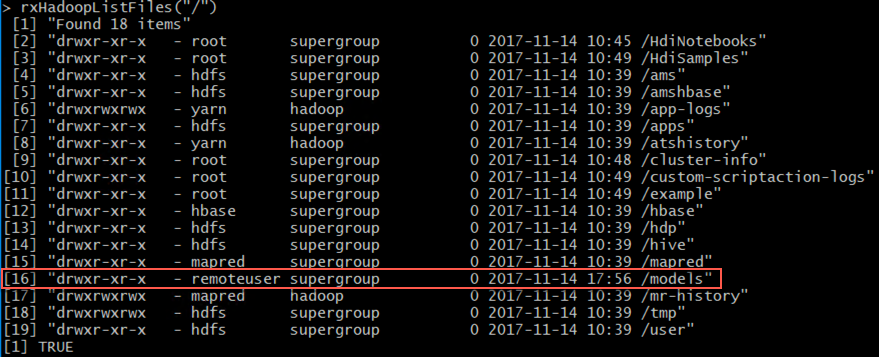

13. Copy the **pricingModel.RData** from the local directory to the **/models** folder in HDFS by running the following command:
    ```
    rxHadoopCopyFromLocal("pricingModel.RData", modelExportDir)
    ```

14. Repeat the previous step for inputExample.RData and sampleData.RData.

15. Run the following command to verify the three files now exist in HDFS (and Blob storage), under /models.
    ```
    rxHadoopListFiles("/models")
    ```

16. The output should look similar to the following:
    
    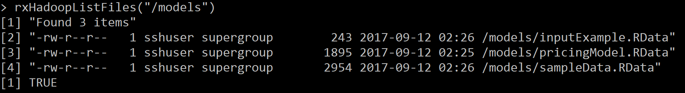

17. Using Visual Studio, Cloud Explorer, navigate to the storage account for your HDInsight cluster, expand: 

    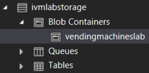

18. Right-click the storage container, and select **Open.**

19. In the editor that appears, double-click the models folder, and verify you see your files.
    
     tab")

20. Right-click **inputExample.RData** and select Save As... and choose the directory for your **PricingModel** project, overwriting files if prompted.

21. Repeat the previous step for **pricingModel.RData** and **sampleData.RData**.

22. You have now used R Server on HDInsight to train a model that you can then upload to R Server Operationalization to expose it as a web service.

### Task 4: Create predictive service in R Server Operationalization

After training a model, you want to operationalize the model so that it becomes available for integration by developers. One way to operationalize a trained model is to take the model you trained in HDInsight, and then to expose that as a predictive web service. In this task, you take a version of the scripts you have been running locally and in HDInsight and migrate them to run in the VM that is running R.

16. In the Azure portal, navigate to the Microsoft Machine Learning Server Virtual Machine you created in [Exercise 1, Task 3](#task-3-create-microsoft-machine-learning-server-on-linux).

17. On top of the Overview blade, select Connect, then copy the SSH command.
    
    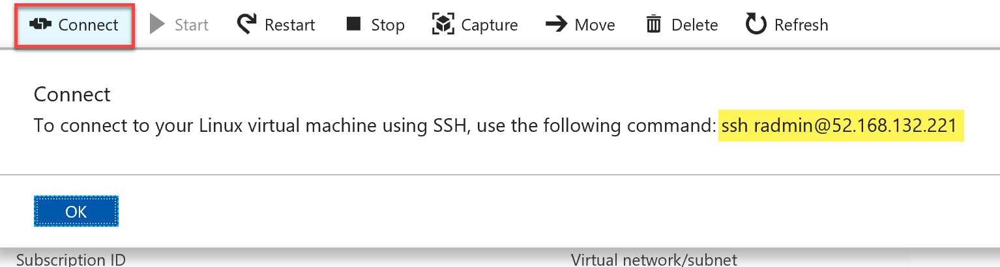

18. Using a new Git Bash window on your Lab VM, SSH into your Microsoft Machine Learning Server VM by pasting the SSH command you copied above at the command prompt. For example:
    **ssh radmin@\<your-server-ip\>.**

19. When prompted if you want to continue connecting, enter yes.

20. Enter your password, **Password.1!!**

21. At the prompt, after successfully logging in, you will need to complete a few tasks to configure and operationalize the environment.

22. Run the following command to act as root: **sudo -i**

23. Now that you are acting as root run the following command to: **az ml admin node setup \--onebox \--admin-password Password.1!! \--confirm-password Password.1!!**

    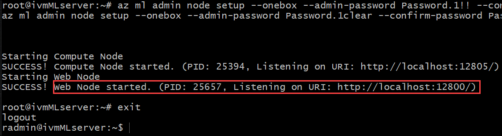

24. In Visual Studio, open the **App.config** for the Simulator project. This can be done by expanding the Simulator project in the Solution Explorer, and double-clicking on **App.config** under the **Simulator** project. 

    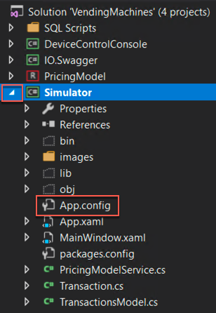

25. Locate the **appSetting** **rServiceBaseAddress** and enter **http://\<your-server-public-ip\>:12800** for the value. (For example: <http://52.168.132.221:12800>). Your server IP address is the same IP address you used for the SSH connection in Step 3 of this task, above.

26. Locate the **appSetting** **rServicePassword** and update its value with the password you defined when you configured your R server for Operationalization (step 11 above), **Password.1!!** 

    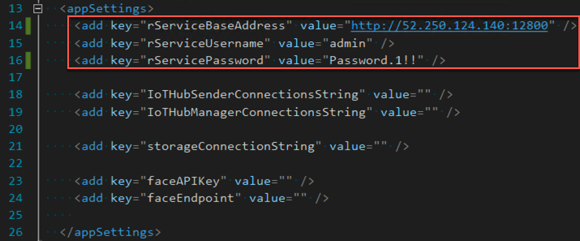

27. Save **App.config**.

28. Open **PredictPricingService.r** within the **PricingModel** project in the Visual Studio Solution Explorer.

    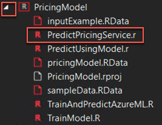

29. Find TODO 1, and replace with the following code block:
    ```
    # TODO: 1. Load packages needed for operationalization
    usePackage <- function(p) {
    if (!is.element(p, installed.packages()[, 1]))
    install.packages(p, dep = TRUE)
    library(p, character.only = TRUE)
    }
    usePackage("curl")
    usePackage("ggplot2")
    usePackage("mrsdeploy")
    usePackage("RevoScaleR")
    ```

30. Find TODO 2, and replace with the following code block to remotely connect to the R Server Operationalization service:
    ```
    # TODO: 2. Configure remote login
    remoteLogin(
    deployr_endpoint = "http://<your-server-ip>:12800",
    username = "admin",
    password = "<your-admin-password>"
    )
    pause()
    ```

**Note:** Make sure to replace **\<your-server-ip\>** with the IP address with your VM's IP address, and enter the password you specified when you configured your R server for Operationalization (step 11) in place of **\<your-admin-password\>**. The TODO 2 section should looking something like the following screen shot.

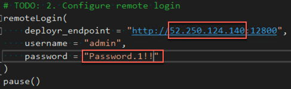

31. Highlight all the code in **PredictPricingService.r**, right-click and then **execute in interactive**. The last output status in the R Interactive window should be "Published service".

32. Find TODO 3 and replace with the following code block to consume the API as a test:
    ```
    # TODO: 3. Consume the API as a test
    services <- listServices("apiPredictPurchasePrice")
    serviceName <- services[[1]]
    api <- getService(serviceName$name, serviceName$version)
    result <- api$apiPredictPurchasePrice(30, "F", "coconut water")
    print("Result: ")
    print(result$output("answer"))
    result
    ```

33. Find TODO 4 and replace with the following code block to generate and save the Swagger JSON file for the API:
    ```
    # TODO: 4. Generate the Swagger JSON file for the API
    swagger <- api$swagger()
    cat(swagger, file = "swagger.json", append = FALSE)
    ```

34. Highlight just the TODO 3 and TODO 4 code blocks you added and execute in interactive.

35. When you scroll up through the R Interactive window results, you should see an output with your prediction like the following:
    ```
    $success
    [1] TRUE

    $errorMessage
    [1] ""

    $outputParameters
    $outputParameters$purchasePrice
    [1] 0.9348741
    ```

36. Also open the swagger.json file in your PricingModel project directory to view its contents. This file can be used within the swagger.io online editor to generate client code to connect to your service. We have already done this for you within the included IO.Swagger project.

## Exercise 2: Implement dynamic pricing

Duration: 45 minutes

In this exercise, you will implement the code that performs dynamic pricing, capitalizing on the Face API to acquire demographics, and your deployed pricing model to suggest the price based on those demographics. You will then run the vending machine simulator and see the dynamic pricing in action.

### Task 1: Implement photo uploads to Azure Storage

1. In Visual Studio Solution Explorer, expand the Simulator project and then **MainWindow.xaml** and then open **MainWindow.xaml.cs**.

    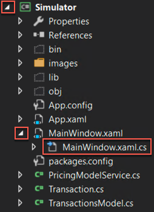

2. Scroll down to the method **UpdateDynamicPricing**. 

    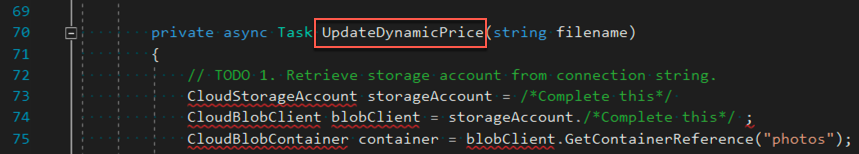

3. Replace TODO 1 with the following:
    ```csharp
    // TODO 1. Retrieve storage account from connection string.
    CloudStorageAccount storageAccount = CloudStorageAccount.Parse(_storageConnectionString);
    CloudBlobClient blobClient = storageAccount.CreateCloudBlobClient();
    CloudBlobContainer container = blobClient.GetContainerReference("photos");
    ```

4. Replace TODO 2 with the following:
    ```csharp
    // TODO 2. Retrieve reference to a blob named with the value of fileName.
    string blobName = Guid.NewGuid().ToString() + System.IO.Path.GetExtension(filename);
    CloudBlockBlob blockBlob = container.GetBlockBlobReference(blobName);
    ```

5. Replace TODO 3 with the following:
    ```csharp
    // TODO 3. Create or overwrite the blob with contents from a local file.
    using (var fileStream = System.IO.File.OpenRead(filename))
    {
        blockBlob.UploadFromStream(fileStream);
    }
    ```

6. Save `MainWindow.xaml.cs`.

### Task 2: Provision Cognitive Services Face API

To provision access to the Face API (which provides demographic information about photos of human subjects), you will need to provision a Cognitive Services account.

1. In the Azure Portal, select **+Create a resource, AI + Cognitive Services,** and select **Face API**.

    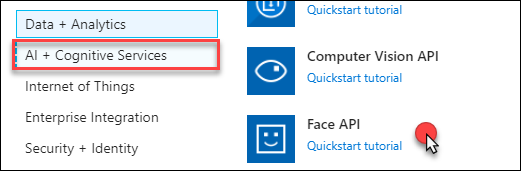

2. On the Create Face API blade:

    * Name: Enter a name.

    * Subscription: Choose your Subscription.

    * Location: Choose the location you've been using for other resources in this lab.

    * Pricing tier: Select the **Free tier (F0)** from the drop-down list.

    * Resource group: Select Use existing, and select the **ivmhandsonlab** resource group from the list.

    * Check the box confirming you have read and understand the legal terms.

    * Click Create to provision the Cognitive Services account.

        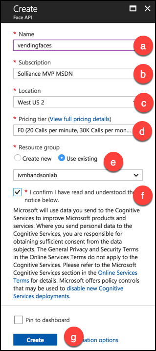

3. When the Face API finishes provisioning, browse to the Cognitive Services Face API by clicking on Go to resource in the Deployment succeeded notification.

    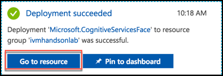

4. On top of the Cognitive Services overview blade, click the Copy button to the right of the Endpoint. Paste this value into a text editor, such as Notepad, for later use.

    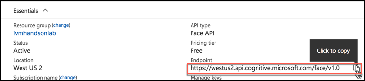

5. In the Cognitive Services blade, click on Keys under the Resource Management heading.

    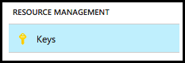

6. Click the Copy button next to the value for Key 1. Paste this value into a text editor, such as Notepad, for later use.

    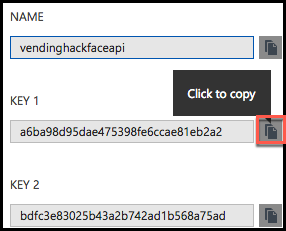

### Task 3: Invoke Face API 

1. Continuing with **MainWindow.xaml.cs**, scroll down to **GetBlobSasUri**. This method will create a Shared Access Signature URI that the Face API can use to securely access the image in blob storage. 

    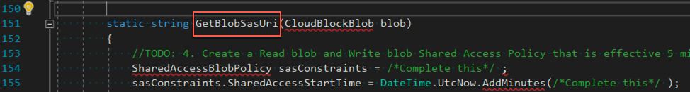

2. Replace TODO 4 with the following:
    ```
    //TODO: 4. Create a Read blob and Write blob Shared Access Policy that is effective 5 minutes ago and for 2 hours into the future
    SharedAccessBlobPolicy sasConstraints = new SharedAccessBlobPolicy();
    sasConstraints.SharedAccessStartTime = DateTime.UtcNow.AddMinutes(-5);
    sasConstraints.SharedAccessExpiryTime = DateTime.UtcNow.AddHours(2);
    sasConstraints.Permissions = SharedAccessBlobPermissions.Read | SharedAccessBlobPermissions.Write;
    ```

3. Replace TODO 5 with the following:
    ```
    //TODO: 5. construct the full URI with SAS
    string sasBlobToken = blob.GetSharedAccessSignature(sasConstraints);
    return blob.Uri + sasBlobToken;
    ```

4. With the SAS URI to the upload photo in hand, scroll to **GetPhotoDemographics** to implement the call to the Face API. 

    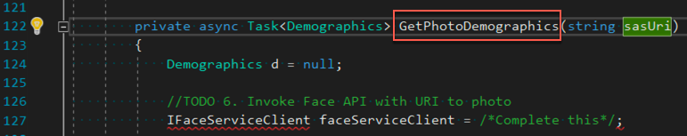

5. Replace TODO 6 with the following:
    ```
    //TODO 6. Invoke Face API with URI to photo
    IFaceServiceClient faceServiceClient = new FaceServiceClient(_faceApiKey, _faceEndpoint);
    ```

6. Replace TODO 7 with the following:
    ```
    //TODO 7. Configure the desired attributes Age and Gender
    IEnumerable<FaceAttributeType> desiredAttributes = new FaceAttributeType[] { FaceAttributeType.Age, FaceAttributeType.Gender };
    ```

7. Replace TODO 8 with the following:
    ```
    //TODO 8. Invoke the Face API Detect operation
    Face[] faces = await faceServiceClient.DetectAsync(sasUri, false, true, desiredAttributes);
    ```

8. Replace TODO 9 with the following:
    ```
    //TODO 9. Extract the age and gender from the Face API response
    double computedAge = faces[0].FaceAttributes.Age;
    string computedGender = faces[0].FaceAttributes.Gender;
    ```

9. Save the file.

### Task 4: Invoke pricing model

1. Within **MainWindow.xaml.cs**, scroll to the end of **UpdateDynamicPrice** and replace TODO 10 with the following:
    ```
    //TODO 10. Invoke the actual ML Model
    PricingModelService pricingModel = new PricingModelService();
    string gender = d.gender == "Female" ? "F" : "M";
    suggestedPrice = await pricingModel.GetSuggestedPrice((int)d.age, gender, _itemName);
    ```

2. Save the file.

### Task 5: Configure the Simulator

1. In the Simulator project, open **App.config**.

2. Within the **appSettings** section, set the following settings (there were copied into a text edit previously):

    a. **faceAPIKey**: set this to the KEY 1 value for your Face API as acquired from the Azure Portal.

    b. **faceEndpoint**: set this to the ENDPOINT value for your Face API as acquired from the Azure Portal (for example: https://eastus2.api.cognitive.microsoft.com/face/v1.0)

    c. **storageConnectionString**: set this to the connection string of the Storage Account you created with the photos container.

3. Save the **App.config**. The updated **App.config** file settings should look similar to the following:

    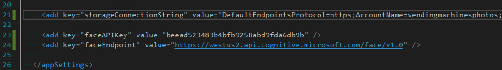

### Task 6: Test dynamic pricing in Simulator

1. Before building the project in Visual Studio, we need to ensure all the NuGet packages are properly restored. In Visual Studio, go to **Tools-\>NuGet Package Manager-\>Package Manager Console** and enter the following command:

**Update-Package -Reinstall**

2. That should force the packages to get downloaded again.

3. Now, in Solution Explorer, right-click the Simulator project, and select **Build**.

4. Ensure that your build generates no errors (View the Output and Errors windows, under the View menu in Visual Studio).

5. Again, in solution explorer, right-click the Simulator project, and select Set as Startup Project.

    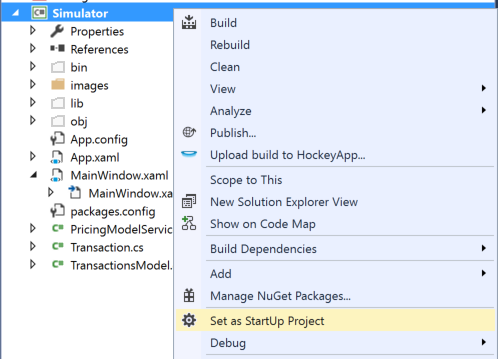

6. From the Debug menu, select Start Without Debugging.
    
    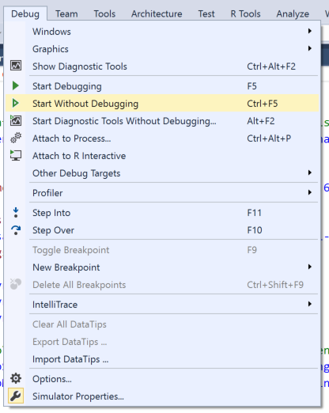

7. When the vending machine simulator appears, **select take picture** at the bottom.
    
    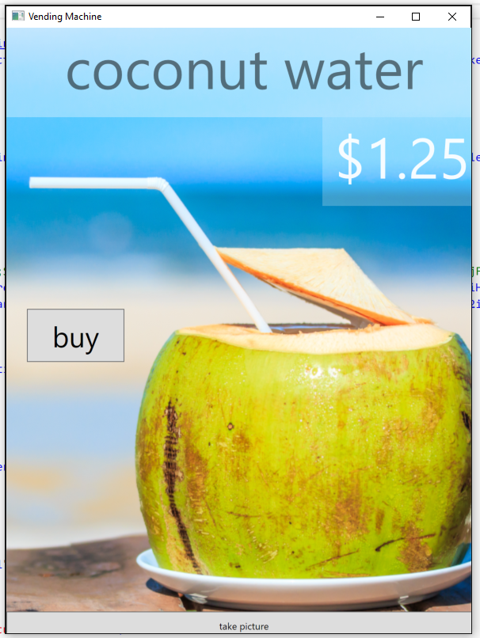

8. In the dialog that appears, navigate to the images folder under **C:\\VendingMachines\\VendingMachines - Clean\\Simulator\\images\\photos**, and pick the photo of either the man or woman to upload, and select Open.
    
    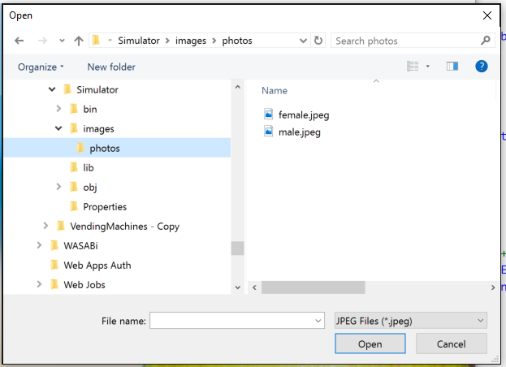

9. In a few moments, you should see the price change from \$1.25 to whatever value the predictive model suggested. 

    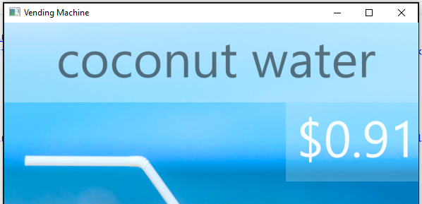

10. Try using the other photo or your own photo to see what prices are suggested.

11. Click the X at the top right of the application to stop it.

## Exercise 3: Implement purchasing

Duration: 15 minutes

In this exercise, you will create an in-memory, columnar index table in SQL DB that will be used to support purchase transactions in a real-time analytics fashion, and then implement the purchasing process in the vending machine simulator. Finally, you will run the simulator and purchase items.

### Task 1: Create the transactions table

1. Within Visual Studio Solution Explorer, expand the SQL Scripts folder and open the file Create Table.sql.
    
    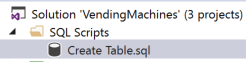

2. Replace TODO 1 with the following:
    ```
    TODO: 1. Transaction ID should be a Primary Key, fields with a b-tree index
    TransactionId int IDENTITY NOT NULL PRIMARY KEY NONCLUSTERED,
    ```

3. Replace TODO 2 with the following:
    ```
    TODO: 2. This table should have a columnar index
    INDEX Transactions_CCI CLUSTERED COLUMNSTORE
    ```

4. Replace TODO 3 with the following:
    ```
    TODO: 3. This should be an in-memory table
    MEMORY_OPTIMIZED = ON
    ```

5. Replace TODO 4 with the following:
    ```
    TODO: 4. In-memory tables should auto-elevate their transaction level to Snapshot
    ALTER DATABASE CURRENT SET MEMORY_OPTIMIZED_ELEVATE_TO_SNAPSHOT=ON;
    ```

6. Save the script.

7. Execute the script by pressing the play icon.

    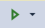

8. Expand **Azure**, and if prompted, sign in with your Azure credentials.

9. From the Azure node, and select the database you created for the vending database. 

    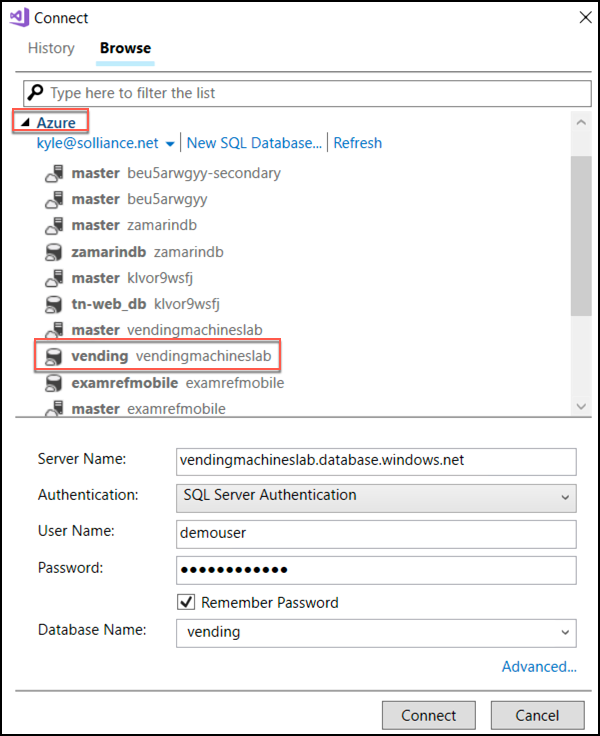

10. In the in fields at the bottom, enter your user name and password for the SQL Server, and select Connect. The script should run successfully.

    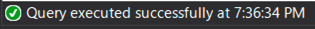

### Task 2: Configure the Simulator

1. In the Simulator project, open **App.config**.

2. Within the **connectionString** section, set the following:

    -   TransactionsModel: set the value of the connectionString attribute to the ADO.NET connection string to your SQL DB instance. This value was copied to a text editor previously, or you can copy it from the Azure Portal. **Do not forget to replace the values for {your\_username} and {your\_password} with your actual credentials.**

        i. User name: demouser

        ii. Password: Password.1!!

1. Save the **App.config**. 

    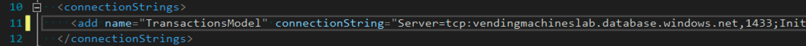

### Task 3: Test purchasing

1. In solution explorer, right-click the Simulator project, and select Build. Note: You may need to ensure the previous instance you started has been closed before rebuilding.

2. Ensure that your build generates no errors.

3. From the Debug menu, select **Start Without Debugging**.

4. In the Simulator, select buy.
    
    

5. You should see a confirmation dialog similar to the following:\
    
    

## Exercise 4: Implement device command and control

Duration: 30 minutes

In this exercise, you will implement the ability to push new promotions to the vending machine simulator using the command and control features of IoT Hub. You will update the simulator to listen for these messages. You will also update the console application DeviceControlConsole to send selected promotions.

### Task 1: Listen for control messages

1. Within Visual Studio Solution Explorer, expand the Simulator project, and open the file **MainWindow.xaml.cs**.

2. Scroll down to the **ListenForControlMessages** method. 

    

3. Uncomment the body of the while(true) loop. You can uncomment a block of code by selecting the code, then selecting the Uncomment button on the toolbar. 

    

4. Replace TODO 1 with the following:
    ```
    //TODO: 1. Receive messages intended for the device via the instance of _deviceClient.
    Microsoft.Azure.Devices.Client.Message receivedMessage = await _deviceClient.ReceiveAsync();
    ```

5. Replace TODO 2 with the following:
    ```
    //TODO: 2. A null message may be received if the wait period expired, so ignore and call the receive operation again
    if (receivedMessage == null) continue;
    ```

6. Replace TODO 3 with the following:
    ```
    //TODO: 3. Deserialize the received binary encoded JSON message into an instance of PromoPackage.
    string receivedJSON = Encoding.ASCII.GetString(receivedMessage.GetBytes());
    System.Diagnostics.Trace.TraceInformation("Received message: {0}", receivedJSON);
    PromoPackage promo = Newtonsoft.Json.JsonConvert.DeserializeObject<PromoPackage>(receivedJSON);
    ```

7. Replace TODO 4 with the following:
    ```
    //TODO: 4. Acknowledge receipt of the message with IoT Hub
    await _deviceClient.CompleteAsync(receivedMessage);
    ```

8. Save the file.

### Task 2: Send control messages

1. Within Visual Studio Solution Explorer, expand the **DeviceControlConsole** project, and open the file **Program.cs**. 

    

2. Scroll down to the PushPromo method. 

    

3. Replace TODO 1 with the following:
    ```
    //TODO: 1. Create a Service Client instance provided the _IoTHubConnectionString
    _serviceClient = ServiceClient.CreateFromConnectionString(_IoTHubConnectionString);
    ```

4. Replace TODO 2 with the following:
    ```
    //TODO: 2. Send the command
    await _serviceClient.SendAsync(deviceId, commandMessage);
    ```

5. Save Program.cs.

### Task 3: Configure the DeviceControlConsole and the Simulator

1. In **DeviceControlConsole**, open **App.config**.

    

2. Set the **IoTHubConnectionString appSetting** to have a value of the connection string for the service policy to your IoT Hub. (Recall you can get this from the Azure Portal IoT Hub blade, Shared access policies, and then select the policy.)

    

3. Set the **storageConnectionString appSetting** to have the same connection string for your storage account that the **App.config** file in the Simulator project has.

4. Save the file.

5. Now, open the **App.config** file In the Simulator project.

6. Set the **IoTHubSenderConnectionString appSetting** to have a value of the connection string for the device policy to your IoT Hub.

7. Set the **IoTHubManagerConnectionString appSetting** to have a value of the connection string for the **iothubowner** policy to your IoT Hub.

8. Save the file.

9. Build the Simulator and DeviceControlConsole projects.

10. In Solution Explorer, right-click Solution 'Vending Machines,' and select Set StartUp Projects.

    

11. In the dialog, select the Multiple startup projects option, and ensure that Action is set to Start for both DeviceControlConsole and Simulator.
    
    

12. Select OK.

13. From the Debug menu, choose Start without Debugging.

14. Wait for both the Vending Machine Simulator and the DeviceControlConsole to appear.
   
    

15. In the DeviceControlConsole, press 1 to push the promotion for Soda.

    

16. Observe that the entire promotion surface of the vending machine changes (product name, price, and image).

**Note:** If the photo does not change, and after a few minutes you receive a DotNetty.Transport\... error, you will need to delete and recreate your IoT Hub in the Azure portal. The error is caused by a communication error between the application and your IoT Hub. Be sure to update your App.config file with the new IoT hub connection strings.

17. Experiment sending the other promotion or toggling between promotions.

18. Experiment with making purchases and sending photos to verify the other functions still work with the new promoted products.

## Exercise 5: Analytics with Power BI Desktop

Duration: 15 minutes

In this exercise, you will use Power BI Desktop to query purchase data from the in-memory table of SQL DB and visualize the result.

### Task 1: Build the query and create the visualization

1. From your Start menu on your Lab VM, open Power BI Desktop.
    
    

2. In the opening dialog, select **Get Data**.

    

3. In the Get Data dialog, select **Azure** in the categories list and then **Azure SQL Database**.
    
    

4. Select Connect.

5. In the dialog, enter the name of your SQL Server (e.g., myserver.database.windows.net), the name of your vending database, and select the **DirectQuery** option. Select OK.
    
    

6. On the next screen, select the **Database** tab on the left, and provide your SQL username (demouser) and password (Password.1!!), then select **Connect**. 
    
    

7. In the Navigator dialog, check the box next to **Transactions**.
    
    

8. Select **Load**.

9. In the Ribbon, select **Edit Queries**.

    

10. In the Query Editor, select the Transaction Date column header to select the column.
    
    

11. In the Ribbon, select the **Add Column** tab and select Time, Hour, Hour. 

    

12. Select the **TransactionDate** column again.

13. In the Ribbon, select **Time, Minute.**\
    
    

14. Select the **TransactionDate** one more time.

15. In the Ribbon, select **Time, Second**.

16. In the Ribbon, on the Home tab, select **Close & Apply**.
    
    

17. In the message that appears, select **Apply Changes**.

    

18. In the Visualizations, select **Stacked column chart**.
    
    

19. From the Fields list, drag the **minute** field over to the **axis** property.

    

20. From the Fields list, drag the **PurchasePrice** over to the **value** property.
    
    

21. Your completed visualization summarizing the most profitable minutes in each hour should appear as follows:

    

## Congratulations, you have completed the Intelligent Vending Machines Hands-on Lab

Please proceed to the [After the hands-on lab](./clean-up.md) section to ensure the Azure resources provisioned for this lab are deleted, and you do not continue to incur charges for those resources.