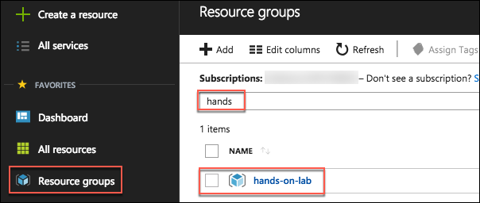
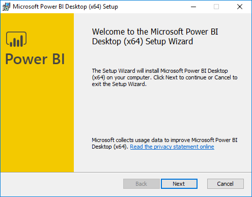
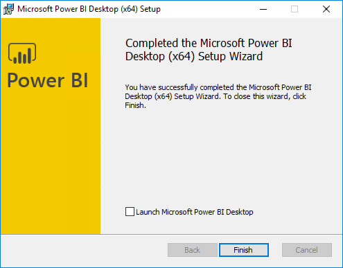

# Appendix A: Create lab resources manually

This appendix provides step-by-step instructions for manually creating the lab resources that are provisioned by the ARM template used in the [Before the Hands-on Lab](./Setup.md) section.

## Contents

* [Task 1: Provision a resource group](#task-1-provision-a-resource-group)
* [Task 2: Provision an R Server on HDInsight with Spark cluster](#task-2-provision-an-r-server-on-hdinsight-with-spark-cluster)
* [Task 3: Setup a lab virtual machine (VM)](#task-3-setup-a-lab-virtual-machine-vm)
* [Task 4 Install Power BI Desktop on the lab VM](#task-4-install-power-bi-desktop-on-the-lab-vm)
* [Task 5: Prepare an SSH client](#task-5-prepare-an-ssh-client)
* [Task 6: Install R Tools for Visual Studio 2017](#task-6-install-r-tools-for-visual-studio-2017)
* [Task 7: Download and open the vending machines starter project](#task-7-download-and-open-the-vending-machines-starter-project)
* [Task 8: Provision IoT Hub](#task-8-provision-iot-hub)
* [Task 9: Create Microsoft Machine Learning Server on Linux](#task-9-create-microsoft-machine-learning-server-on-linux)
* [Task 10: Create Storage Account](#task-10-create-storage-account)
* [Task 11: Provision Cognitive Services Face API](#task-11-provision-cognitive-services-face-api)
* [Task 12: Provision SQL Database](#task-12-provision-sql-database)

## Task 1: Provision a resource group

In this task, you will create an Azure resource group for the resources used throughout this lab.

1. In the [Azure portal](https://portal.azure.com), select **Resource groups**, select **+Add**, then enter the following in the Create an empty resource group blade:

    * **Name**: Enter hands-on-lab-SUFFIX

    * **Subscription**: Select the subscription you are using for this hands-on lab

    * **Resource group location**: Select the region you would like to use for resources in this hands-on lab. Remember this location so you can use it for the other resources you'll provision throughout this lab.

        

    * Select **Create**.

## Task 2: Provision an R Server on HDInsight with Spark cluster

In this task, you will use the Azure Portal to provision an R Server on HDInsight with Spark cluster.

1. Open a browser and navigate to the [Azure portal](https://portal.azure.com).

2. Select **+Create a resource**, enter "hdinsight" into the Search the Marketplace box,select **HDInsight** in the results, and select **Create**.

    

3. On the Basics blade, enter the following settings:

    * **Cluster name**: Enter a unique name (verified by the green checkmark)

    * **Subscription**: Select the Azure subscription into which you want to deploy the cluster

    * **Custer type**: Select Configure required settings

        

        * On the Cluster configuration blade, set the Cluster type to **R Server** and the Version to R Server **9.1 (HDI 3.6)**

        * Check the box next to **R Studio community edition for R Server**. Note that the Operating System option for the Spark cluster is fixed to Linux

            

        * Select **Select** to close the Cluster configuration blade

    * **Cluster login username**: Leave as admin

    * **Cluster login password**: Enter Password.1!!

    * **Secure Shell (SSH) username**: Set to remoteuser (**this is required**)

    * **Use same password as cluster login**: Ensure the checkbox is checked

    * **Resource group**: Choose Use existing, and select the hands-on-lab-SUFFIX resource group

    * **Location**: Select the location you are using for resources in this hands-on lab

        

    * Select **Next** to move on to the storage settings

4. On the Storage blade:

    * **Primary storage type**: Leave set to Azure Storage

    * **Selection Method**: Leave set to My subscriptions

    * **Select a Storage account**: Select Create new, and enter a unique name for the storage account, such as labstorageSUFFIX

    * **Default container**: Set to the *name of your cluster*

    * **Additional storage accounts**: Leave unconfigured.

    * **Data Lake Store access**: Leave unconfigured.

    * **Metastore Settings**: Leave blank.

        

    * Select **Next** to move on to the Cluster summary.

5. On the Cluster Summary blade, select Edit next to Cluster Size.

    

6. On the Cluster size blade, enter the following:

    * **Number of worker nodes**: Enter 2

    * **Worker node size**: Select D12 v2, then select Select

    * **Head node size**: Select D12 v2, then select Select

    * **Zookeeper node sizes**: Leave set to A2

    * **R-Server edge node size**: Select D12 v2, then select Select

        

    * Select **Next**.

7. Select **Next** on the Advanced settings blade to move to the Cluster summary blade.

8. Select **Create** on the Cluster summary blade to create the cluster.

9. It will take approximately 20 minutes to create you cluster. You can move on to the steps below while the cluster is provisioning.

## Task 2: Setup a lab virtual machine (VM)

1. In the [Azure portal](https://portal.azure.com/), select **+Create a resource**, enter "visual studio community" into the Search the Marketplace box, select **Visual Studio Community 2017 (latest release) on Windows Server 2016 (x64)** from the results, and select **Create**.

    

2. Set the following configuration on the Basics tab.

    * **Name**: Enter LabVM

    * **VM disk type**: Select SSD

    * **User name**: Enter demouser

    * **Password**: Enter Password.1!!

    * **Subscription**: Select the same subscription you are using for this hands-on lab

    * **Resource Group**: Select Use existing, and select the hands-on-lab-SUFFIX resource group

    * **Location**: Select the location you are using for resources in this hands-on lab

        

    * Select **OK** to move to the next step.

3. On the Choose a size blade, ensure the Supported disk type is set to SSD, and select View all. This machine won't be doing much heavy lifting, so selecting DS2_V3 Standard is a good baseline option.

    

4. Select **Select** to move on to the Settings blade.

5. Accept all the default values on the Settings blade, and select **OK**.

6. Select **Create** on the Create blade to provision the virtual machine.

7. It may take 10+ minutes for the virtual machine to complete provisioning.

## Task 3: Install Power BI Desktop on the lab VM

1. Connect to the **LabVM**. (If you are already connected to your Lab VM, skip to Step 7.)

2. From the left side menu in the Azure portal, click on Resource groups, then enter your resource group name into the filter box, and select it from the list.

    

3. Next, select your lab virtual machine, LabVM, from the list.

    

4. On your Lab VM blade, select Connect from the top menu.

    

5. Download and open the RDP file.

6. Select **Connect**, and enter the following credentials:

    a. User name: **demouser**

    b. Password: **Password.1!!**

7. Once logged in, launch the **Server Manager**. This should start automatically, but you can access it via the Start menu if it does not start.

8. Select **Local Server**, then select **On** next to **IE Enhanced Security Configuration**.

    

9. In the Internet Explorer Enhanced Security Configuration dialog, select **Off under Administrators**, then select **OK**.

    

10. Close the Server Manager.

11. In a web browser on the Lab VM navigate to the [Power BI Desktop download page](https://www.microsoft.com/en-us/download/details.aspx?id=45331)

12. Select the **Download Free** link in the middle of the page.

    

13. Select the **x64 bit version** of the download, then select **Next**.

    

14. Run the installer once it downloads.

15. Select Next on the welcome screen.

    

16. Accept the license agreement, and select Next.

    

17. Leave the default destination folder, and select Next.

    

18. Make sure the Create a desktop shortcut box is checked, and select Install.

    

19. Uncheck Launch Microsoft Power BI Desktop, and select Finish.

    

## Task 4: Enable the Windows Subsystem for Linux

In this task, you will use PowerShell to download and install the Windows Subsystem for Linux (WSL) using a Ubuntu Linux distribution. You will use this to access your HDInsight cluster from your Lab VM.

1. On your Lab VM, open PowerShell as Administrator and run the following:

    ```powershell
    Enable-WindowsOptionalFeature -Online -FeatureName Microsoft-Windows-Subsystem-Linux
    ```

2. Restart your computer when prompted.

3. Reconnect to your Lab VM (TODO: Add pointer here to Connect steps in Before the lab...)

4. Download the Ubuntu Linux distribution using the `Invoke-WebRequest` command, as follows:

    ```powershell
    Invoke-WebRequest -Uri https://aka.ms/wsl-ubuntu-1604 -OutFile ~/Ubuntu.zip -UseBasicParsing
    ```

5. Unzip the downloaded file.

    ```powershell
    Expand-Archive ~/Ubuntu.zip ~/Ubuntu
    ```

    > Make sure your target directory (~/Ubuntu in this example) is on your system drive. Usually this is your C: drive. For example: C:\Distros\Ubuntu.

6. Check the Launch Git Bash checkbox, and uncheck View Release Notes. Select **Finish**.

7. The Git Bash client should open in a new window.

8. At the command prompt, enter **ssh remoteuser@\<clustername\>-ssh.azurehdinsight.net**, replacing \<clustername\> with the name of the HDInsight cluster created in [Task 1](#task-1-provision-an-r-server-on-hdinsight-with-spark-cluster) above.

    > Note: You will need to wait for the cluster deployment to complete in Azure before you can complete this step.

    

9. Respond to any prompts in the SSH window, and enter the password for **remoteuser** when prompted.

10. Use WSL for SSH during the hands-on lab for any instructions requiring an SSH connection. You can repeat these steps any time to re-connect.