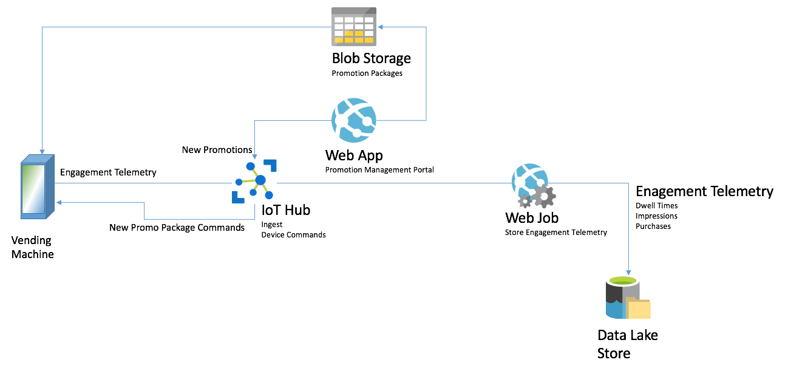

[Legal notice](../legal.md)

Updated May 2018

# Intelligent vending machines whiteboard design session trainer guide

In this whiteboard design session, you will design an IoT solution for intelligent vending machines, leveraging facial feature recognition and Azure Machine Learning, to gain a better understanding of building cloud-based machine learning apps and real-time analytics with SQL Database in-memory and columnar indexing.

## Contents

* [Trainer information](#trainer-information)
  * [Role of the trainer](#role-of-the-trainer)
  * [Whiteboard design session flow](#whiteboard-design-session-flow)
  * [Before the whiteboard design session: How to prepare](#before-the-whiteboard-design-session-how-to-prepare)
  * [During the whiteboard design session: Tips for an effective whiteboard design session](#during-the-whiteboard-design-session-tips-for-an-effective-whiteboard-design-session)
* [Intelligent vending machines whiteboard design session student guide](#intelligent-vending-machines-whiteboard-design-session-student-guide)
* [Step 1: Review the customer case study](#step-1-review-the-customer-case-study-1)
* [Step 2: Design a proof of concept solution](#step-2-design-a-proof-of-concept-solution-1)
* [Step 3: Present the solution](#step-3-present-the-solution-1)
* [Wrap-up](#wrap-up)
  * [Preferred target audience](#preferred-target-audience)
  * [Preferred solution](#preferred-solution)
  * [Checklist of preferred objection handling](#checklist-of-preferred-objection-handling)
  * [Customer quote (to be read back to the attendees at the end)](#customer-quote-to-be-read-back-to-the-attendees-at-the-end)

## Trainer information

Thank you for taking time to support the whiteboard design sessions as a trainer!

### Role of the trainer

An amazing trainer:

* Creates a safe environment in which learning can take place.
* Stimulates the participant's thinking.
* Involves the participant in the learning process.
* Manages the learning process (on time, on topic, and adjusting to benefit participants).
* Ensures individual participant accountability.
* Ties it all together for the participant.
* Provides insight and experience to the learning process.
* Effectively leads the whiteboard design session discussion.
* Monitors quality and appropriateness of participant deliverables.
* Effectively leads the feedback process.

### Whiteboard design session flow

Each whiteboard design session uses the following flow:

#### Step 1: Review the customer case study (15 minutes)

**Outcome**: Analyze your customer's needs

* Customer's background, situation, needs and technical requirements
* Current customer infrastructure and architecture
* Potential issues, objectives and blockers

#### Step 2: Design a proof of concept solution (60 minutes)

**Outcome**: Prepare to present a solution for your target customer audience

* Determine your target customer audience
* Determine customer's business needs to address your solution
* Design and diagram your solution
* Prepare to present your solution

#### Step 3: Present the solution (30 minutes)

**Outcome**: Present solution to your customer

* Present solution
* Respond to customer objections
* Receive feedback

#### Wrap-up (15 minutes)

* Review preferred solution

### Before the whiteboard design session: How to prepare

Before conducting your first whiteboard design session:

* Read the Student guide (including the case study) and Trainer guide
* Become familiar with all key points and activities.
* Plan the point you want to stress, which questions you want to drive, transitions, and be ready to answer questions.
* Prior to the whiteboard design session, discuss the case study to pick up more ideas.
* Make notes for later.

### During the whiteboard design session: Tips for an effective whiteboard design session

**Refer to the Trainer guide** to stay on track and observe the timings.

**Do not expect to memorize every detail** of the whiteboard design session.

When participants are doing activities, you can **look ahead to refresh your memory**.

* **Adjust activity and whiteboard design session pace** as needed to allow time for presenting, feedback, and sharing.
* **Add examples, points, and stories** from your own experience. Think about stories you can share that help you make your points clearly and effectively.
* **Consider creating a "parking lot"** to record issues or questions raised that are outside the scope of the whiteboard design session or can be answered later. Decide how you will address these issues, so you can acknowledge them without being derailed by them.

**Have fun**! Encourage participants to have fun and share!

**Involve your participants.** Talk and share your knowledge but always involve your participants, even while you are the one speaking.

**Ask questions** and get them to share to fully involve your group in the learning process.

**Ask first**, whenever possible. Before launching into a topic, learn your audience's opinions about it and experiences with it. Asking first enables you to assess their level of knowledge and experience, and leaves them more open to what you are presenting.

**Wait for responses**. If you ask a question such as, "What's your experience with (fill in the blank)?" then wait. Do not be afraid of a little silence. If you leap into the silence, your participants will feel you are not serious about involving them and will become passive. Give participants a chance to think, and if no one answers, patiently ask again. You will usually get a response.

## Intelligent vending machines whiteboard design session student guide

Refer to the [Student Guide](./Student-guide.md)

## Step 1: Review the customer case study

* Check in with your table participants to introduce yourself as the trainer.
* Ask, "What questions do you have about the customer case study?"
* Briefly review the steps and timeframes of the whiteboard design session.
* Ready, set, go! Let the table participants begin.

## Step 2: Design a proof of concept solution

* Check in with your tables to ensure that they are transitioning from step to step on time.
* Provide some feedback on their responses to the business needs and design.
  * Try asking questions first that will lead the participants to discover the answers on their own.
* Provide feedback for their responses to the customer's objections.
  * Try asking questions first that will lead the participants to discover the answers on their own.

## Step 3: Present the solution

* Determine which table will be paired with your table before Step 3 begins.
* For the first round, assign one table as the Microsoft team and the other table as the customer.
* Have the Microsoft team present their solution to the customer team.
  * Have the customer team provide one objection for the Microsoft team to respond to.
  * The presentation and objections should be no longer than 10 minutes.
* Have participants on the customer team give feedback to the Microsoft team.
  * The feedback should be no longer than 5 minutes.
  * If needed, the trainer may also provide feedback.

## Wrap-up

* Have the table participants reconvene with the larger session group to hear a SME share the following preferred solution.

### Preferred target audience

* Grant Trey, Chief Innovation Officer, Trey Research
* Dan Cole, VP of Engineering, Trey Research
* The primary audience is the business and technology decision makers. From the case study scenario, this would include the Director of Analytics. Usually we talk to the infrastructure managers who report to the chief information officers (CIOs), or to application sponsors (like a vice president [VP] line of business [LOB], or chief marketing officer [CMO]), or to those that represent the business unit IT or developers that report to application sponsors.

### Preferred solution

#### High-level architecture

1. Without getting into the details (the following sections will address the details), diagram your initial vision for handling the top-level requirements for data loading, data preparation, storage, machine learning modeling, and reporting. You will refine this diagram as you proceed.

    The high-level view of the entire solution appears as follows.

    ![Diagram of the preferred solution. From a high-level, the commerce solution uses an API App to host the Payments web service with which the Vending Machine interacts to conduct purchase transactions. The Payment Web API invokes a 3rd party payment gateway as needed for authorizing and capturing credit card payments, and logs the purchase transaction to SQL DB. The data for these purchase transactions is stored using an In-Memory table with a Columnar Index, which will support the write-heavy workload while still allowing analytics to operate, such as queries coming from Power BI Desktop.](./media/preferred-solution-architecture.png "Preferred high-level architecture")

    It is easier to understand the solution by looking at the individual flows for each of commerce, engagement telemetry and intelligent promotions.

    The commerce solution, as illustrated below, uses an API App to host the Payments web service with which the Vending Machine interacts to conduct purchase transactions. The Payment Web API invokes a 3rd party payment gateway as needed for authorizing and capturing credit card payments, and logs the purchase transaction to SQL DB. The data for purchase transactions in SQL DB is stored using an In-Memory table with a Columnar Index, which will support the write-heavy workload while still allowing analytics to operate, such as queries coming from Power BI Desktop.

    

    The engagement telemetry solution uses IoT Hub to ingest and temporarily store telemetry data from the vending machine. A Web Job (or Stream Analytics) is used to pull the telemetry messages from IoT Hub and archive them in Azure Data Lake Store. New promotion packages are pushed from the Web App hosting the promotion management portal website to Blob storage. A SAS URL is generated to the promotion package intended for the vending machine and sent to the vending machine via IoT Hub cloud to device messaging. The vending machine receives the message, and then downloads the new promotion package from Blob Storage.

    

    The intelligent promotions solution begins when a customer walks up to a vending machine. The machine takes a picture of the customer and sends it to a web service hosted in an API App. The API App integrates the Face API to acquire the demographics of the person in the photo. It can then invoke the dynamic pricing machine learning model hosted either in Azure ML or in Microsoft Machine Learning Server Operationalization, to get the recommended product and price. Finally, all computed demographics and recommendations should be saved to Azure Data Lake Store to be able to improve the training of the Machine Learning model built with R and trained on R Server on HDInsight.

    

    > **NOTE**: The preferred solution is only one of many possible, viable approaches.

#### Commerce

1. How would you recommend that Trey complete purchase transactions and store their purchase transaction history in Azure?

    *Trey research should provision an API App that will host the web service responsible for payments. This API app can examine the payment instrument used in the purchase transaction. If the payment instrument is credit card, it should make a call out to the 3rd party payment gateway to authorize and capture payment. If the credit card payment is successful or the payment instrument is cash, then the successful transaction should then be captured in Azure SQL Database, as well as a success result returned to the vending machine to dispense the product. In the case of a transaction aborted at the vending machine (e.g., because the currency provided was rejected) a transaction with an aborted status should be sent from the vending machine and logged. In the case when the credit card is declined by the payment gateway, a card declined result should be returned to the vending machine and allow the consumer to either enter a different form of payment (e.g., cash or a different credit card) or to abort the transaction.*

2. What services would you suggest and how would you configure the storage and indexing? Be specific.

    *To support the write-heavy workload that results from storing successful and aborted transactions, Trey should configure the transactions table as an In-Memory table with a Non-Clustered Columnar Index. The In-Memory (memory-optimized) table is configured with durability of SCHEMA_AND_DATA, enabling the benefit of supporting large numbers of insert queries without the risk of losing data because it provides fully durable transactions that write the transaction log to disk before returning control to the client.*

    *The primary key on this table would be an identity column using a Hash index (enabling fast point lookups for specific transactions whilst still allowing for fast row inserts).*

    *The Non-Clustered Columnar Index would be configured on all the columns. The effect of this is that the columnstore index maintains a copy of the data, enabling OLTP and analytics workloads to run against separate copies of the data. To leverage the memory-optimized features, Trey would need to deploy the Premium tier of Azure SQL Database.*

#### Engagement analytics

1. What service would you recommend Trey capitalize on in order to scalably ingest the engagement telemetry directly from the vending machines?

    *Trey should use IoT hubs to initially ingest and temporarily store engagement telemetry from the vending machines. While Event Hubs could also be utilized for this purpose, the requirement to send commands to the vending machine to support intelligent promotions would only be supported by IoT Hubs (since it provides functionality for both device-to-cloud and cloud-to-device messaging).*

2. Would you recommend they use Azure Storage Blobs or Azure Data Lake Store for persisting their engagement telemetry? Be specific with your reasoning.

    *Trey should consider using Azure Data Lake Store because it addresses their concern of "maxing out" their storage capacity. Unlike Azure Storage Blobs (which has a maximum capacity of 500 TB) per account, Azure Data Lake Store has no fixed upper limits and scales as Trey's storage needs scale. To accomplish a similar goal with Azure Storage would mean provisioning new Azure Storage accounts each time the limit is approached, and managing the storage of the data across multiple Azure Storage accounts.*

3. What service handles processing the ingested telemetry, at least in so far as persisting the telemetry to the durable storage you recommended? How is this configured or implemented?

    *Given that the scenario specified no additional processing on the ingested telemetry other than to store it, the simplest option would be to configure an Azure Stream Analytics job to pull the data from IoT Hub and configure the Data Lake Store as the stream output. While this approach requires no code, it currently comes with a potential challenge for Trey. That is, every 90 days the authorization for Stream Analytics to access Azure Data Lake Store needs to be renewed. To renew the authorization will require Trey to stop their Stream Analytics job, renew the authorization and restart it. This, of course, would stop the flow of telemetry from the vending machines to storage temporarily (although no telemetry would be lost as it would simply collect in the IoT Hub queue). If this is a concern for Trey, they could instead use a Web Job that is running the Event Processor Host (from the Service Bus SDK), and implement an Event Processor that uses the Azure Data Lake Store SDK to write the telemetry pulled from IoT Hub.*

#### Facial demographics

1. What Azure service or API would you suggest Trey utilize for determining demographics about a consumer from a photo of them taken by the vending machine? How is this provisioned and utilized?

    *Trey can utilize the Face API, a part of Microsoft Cognitive Services. The Face API exposes a Face Detect operation that, provided a URL to photo, returns demographics about the subject of the photo including features such as age, gender, facial expression, facial hair, head position and if any form of glasses (reading, sunglasses, swim goggles, etc.) are detected. To accomplish this, Trey would need to provision a Cognitive Services account with an API type of Face API in the Portal. They would also need to provision an API App that would receive the photo from the vending machine, temporarily store it in Blob storage, and provide the URL (using a SAS token) to the Face API. Once the demographics have been retrieved from the Face API, the API App can delete the photo from blob storage to preserve anonymity.*

#### Intelligent promotions

1. What technology would you recommend that Trey use for implementing their machine learning model that recommends a product and price given consumer demographics?

    *Given Trey's concern about training datasets in the 10's of GB, you should first check that they really do need those large datasets to accurately train their model---in many cases very high accuracy can be achieved with datasets many times smaller, so it is important to involve a Data Scientist to verify this concern. If large training data sets are required, Azure Machine Learning cannot be used (since the maximum dataset size it can access is 10GB).*

    *Instead, Trey should look at running R Server on HDInsight or SparkR on Azure Databricks. This would enable them to program their machine learning models in R, but also be able to address large training data sets as well as reducing training time by being able to parallelize the training across multiple nodes in a cluster.*

2. How would you guide Trey to load data, so it can be used for training the machine learning model?

    *Trey should be capturing the telemetry to Azure Data Lake Store, which can be accessed from R Server on HDInsight.*

3. What category of machine learning algorithm would you recommend to Trey for use in constructing their model? For this scenario your options are clustering, regression or two-class classification. Why?

    *Trey could implement their model using linear regression that would center around predicting the price at which to sell the items in the inventory of the vending machine, given the product and the demographics. A second model could be used that implements a two-class classification (sold or not sold) that predicts which product is likely to be bought given the product, demographics and recommended price.*

4. How would you operationalize your trained model, so it can be invoked with the demographics?

    *They should expose the trained model as a web service. One possible approach is to leverage Azure Machine Learning to host the trained model as a scoring service. To score by using an Azure Machine Learning web service, Trey could use the open source Azure Machine Learning R package to publish their model as an Azure web service. They would use the features of Azure Machine Learning to create an interface for the web service, and then call the web service as needed for scoring.*

    *There is one caveat with this approach- Trey would need to convert any ScaleR model objects to equivalent open-source model objects for use with the web service. This can be done through the use of ScaleR coercion functions, such as as.randomForest() for ensemble-based models. By doing this, Trey would be forgoing the scale out capabilities of the ScaleR objects.*

    *To maintain the scale out capabilities, Trey could provision a server running Microsoft Machine Learning Server Operationalization, which would enable them to deploy their R scripts and models as a web service. These web services can run models built with ScaleR functions and therefore Trey would not need to sacrifice the scale-out training capability in order to achieve easy operationalization into web services.*

    *Another option for Trey to consider would be using IoT Edge, which would allow them to train their models in the cloud, and run them on edge devices, such as their vending machines. This service is meant for customers who want to analyze data on devices instead of in the cloud. By moving parts of their workload to the edge, their devices can spend less time sending messages to the cloud and react more quickly to changes in status.*

5. Where would you store the packages containing promotional artifacts for download by the vending machine and how would you instruct the vending machine to download and install them? Be specific on any Azure services used.

    *The packages could be stored in Blob storage. A SAS signature could be generated that the vending machine would use to download the package. This SAS URI would be provided by sending a command to the specific vending machine using IoT Hub.*

#### Visualization and reporting

1. What tool would you recommend Trey utilize for performing ad-hoc wrangling, exploration and visualization of their data?

    *They could use Power BI Desktop. The Query Editor functionality would enable them to filter and shape the data before visualizing it in reports and creating dashboards.*

2. How would you make the resulting visualization available to others in the organization?

    *They can publish their reports to PowerBI.com.*

## Checklist of preferred objection handling

1. We've heard that Azure's machine learning can only train on data sets up to 10GB in size, are we blocked?

    *While this is true for datasets processed using Azure Machine Learning, this is not the case in Azure when using R Server, either on HDInsight or as SQL Server R Services with SQL Server in a VM.*

2. While not required in the short term, would our machine learning approach enable us to support reinforcement learning (whereby recommendations that lead to a purchase are preferred over time)?

    *Reinforcement learning requires a training loop that feeds successful predictions back into the model to improve. Azure Machine Learning does not support this, but there are various R learners (that can run on R Server on HDInsight) that support reinforcement.*

3. Can we really perform real-time analytics using only a single data store? We cannot afford to lose any of our purchase transaction data.

    *Yes. Real-time analytics in SQL Server 2016 and Azure SQL Database is an approach that aims to provide support for analytics workloads (e.g., queries that compute aggregates over large portions of a dataset) while not affecting the performance or durability of transactional workloads (e.g., those that are write/query intensive). This is accomplished with the In-Memory and Columnar Index features.*

4. We are concerned that training our models will take too long.

    *Azure Machine Learning currently uses a single A8 virtual machine instance to train a model and does not utilize algorithms that parallelize across cores. R Server on HDInsight provides specialized algorithms that parallelize across server cores and across nodes in the HDInsight cluster. SQL Server R Services does not currently parallelize training across servers in a cluster.*

## Customer quote (to be read back to the attendees at the end)

"We are predicting a future full of intelligent vending machines, thanks to Azure."

Grant Trey, Chief Innovation Officer, Trey Research